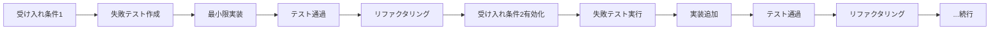

# テスト実装ガイド

このドキュメントは、履修管理システムのテスト実装に関する詳細なガイドラインです。

## AcceptanceTDD（受け入れテスト駆動開発）

### 基本原則
1. **段階的実装**: 受け入れ条件を1つずつ完了させる
2. **TDDサイクル**: Red（失敗）→ Green（成功）→ Refactor（改善）
3. **最小限実装**: 各段階で過剰実装を避ける
4. **継続的改善**: 各フェーズで設計品質を向上

### 実装フロー



## テストファイル構成テンプレート

```typescript
import { describe, it } from "vitest";
import { Effect, Layer, Ref } from "effect";
import { createRegistrationSession } from "../../src/contexts/enrollment/application/commands/create-registration-session.js";
import { StudentId, Term } from "../../src/contexts/enrollment/domain/models/shared/value-objects.js";
import { InMemoryEventStore } from "../../src/contexts/shared/infrastructure/event-store/in-memory-event-store.js";
import { InMemoryRegistrationSessionRepository } from "../../src/contexts/enrollment/infrastructure/persistence/in-memory-registration-session-repository.js";
import { InMemoryEventBus } from "../../src/contexts/shared/infrastructure/event-bus/in-memory-event-bus.js";
import { EventBus } from "../../src/contexts/shared/kernel/types/event-bus.js";
import { DomainEvent } from "../../src/contexts/enrollment/domain/events/registration-session-events.js";
import {
  thenSessionIdFormatIsValid,
  thenRegistrationSessionCreatedEventIsPublished,
  thenRegistrationSessionCanBeRetrieved,
} from "../helpers/assertions.js";

// === Given（前提条件）ヘルパー関数 ===
const givenValidStudentAndTerm = () =>
  Effect.gen(function* () {
    const studentId = StudentId.make("S12345678"); // 田中太郎の学生ID
    const term = Term.make("2024-Spring");          // 2024年春学期
    return { studentId, term };
  });

const givenEventCapture = () =>
  Effect.gen(function* () {
    const capturedEvents = yield* Ref.make<DomainEvent[]>([]);
    const eventBus = yield* EventBus;
    yield* eventBus.subscribe((event) =>
      Ref.update(capturedEvents, (events) => [...events, event])
    );
    return capturedEvents;
  });

describe("ストーリーX: [機能名]", () => {
  // TestLayer構成（標準パターン）
  const TestLayer = Layer.mergeAll(
    InMemoryEventStore,
    InMemoryEventBus,
    InMemoryRegistrationSessionRepository.pipe(
      Layer.provide(Layer.mergeAll(InMemoryEventStore, InMemoryEventBus))
    )
  );

  describe("基本シナリオ", () => {
    // Phase 1: 基本正常系（最初はこれのみ有効）
    it("AC1: [最重要な正常系受け入れ条件]", () =>
      Effect.gen(function* () {
        // Given: 前提条件の設定（日本語コメント推奨）
        const { studentId, term } = yield* givenValidStudentAndTerm();
        const capturedEvents = yield* givenEventCapture();

        // When: 機能実行（実際のビジネスアクション）
        const sessionId = yield* createRegistrationSession({ studentId, term });

        // Then: 結果検証（カスタムアサーション活用）
        thenSessionIdFormatIsValid(sessionId);
        yield* thenRegistrationSessionCreatedEventIsPublished(capturedEvents, sessionId, studentId, term);
        yield* thenRegistrationSessionCanBeRetrieved(sessionId, studentId, term);
      })
        .pipe(Effect.provide(TestLayer))
        .pipe(Effect.runPromise)
    );
  });

  describe("異常系シナリオ", () => {
    // Phase 2: 主要異常系（最初は全てskip状態で実装）
    it.skip("AC2: [重要異常系1の説明]", () =>
      Effect.gen(function* () {
        // Given: エラーが発生する前提条件
        const { studentId, term } = yield* givenValidStudentAndTerm();
        
        // When: エラーが期待される操作（Effect.flip使用）
        const error = yield* createRegistrationSession({ studentId, term }).pipe(
          Effect.flip // 失敗をSuccessに変換
        );

        // Then: エラーの詳細検証
        assertSpecificError(error, expectedParams);
      })
        .pipe(Effect.provide(TestLayer))
        .pipe(Effect.runPromise)
    );

    it.skip("AC3: [重要異常系2の説明]", () => {
      // 同様のパターンで実装
    });
  });

  describe("境界値・エッジケース", () => {
    it.skip("AC4: [境界値1の説明]", () => {
      // 境界値テストの実装
    });

    it.skip("AC5: [境界値2の説明]", () => {
      // 境界値テストの実装
    });
  });
});
```

## カスタムアサーション実装ガイド

### 基本構造
```typescript
// tests/helpers/assertions.ts

// 単純な同期的アサーション
export const thenSimpleAssertion = (actual: any, expected: any) => {
  expect(actual).toBe(expected);
};

// Effect型を返す非同期アサーション
export const thenAsyncAssertion = (
  dependency: SomeDependency,
  expectedValue: ExpectedType
) =>
  Effect.gen(function* () {
    const result = yield* dependency.someOperation();
    expect(result).toMatchObject(expectedValue);
  });

// 複合的なアサーション
export const thenComplexAssertion = ({
  sessionId,
  expectedStudentId,
  expectedTerm,
  capturedEvents
}: AssertionParams) =>
  Effect.gen(function* () {
    // 複数の検証を組み合わせる
    thenSessionIdFormatIsValid(sessionId);
    yield* thenEventPublished(capturedEvents, "RegistrationSessionCreated", {
      sessionId,
      studentId: expectedStudentId,
      term: expectedTerm
    });
    yield* thenAggregateExists(sessionId);
  });
```

### 命名規則
- `then[ExpectedResult]()` - 期待される結果を表現
- 日本語での説明的な名前も可（例: `then重複エラーが発生する`）

## Effect.flipパターン詳解

### 正しい使用方法
```typescript
// ✅ 良い例: Effect.flipで失敗を成功として扱う
it("エラーケースのテスト", () =>
  Effect.gen(function* () {
    // Given
    const duplicateInput = createDuplicateScenario();

    // When: 失敗が期待される操作
    const error = yield* someCommand(duplicateInput).pipe(
      Effect.flip // DomainError型が返される
    );

    // Then: 型安全なエラー検証
    expect(error._tag).toBe("DuplicateError");
    if (error._tag === "DuplicateError") {
      expect(error.duplicateId).toBe(expectedId);
    }
  })
    .pipe(Effect.provide(TestLayer))
    .pipe(Effect.runPromise)
);
```

### 避けるべきパターン
```typescript
// ❌ 悪い例: try-catchの使用
try {
  await someCommand(duplicateInput);
  expect.fail("Should have thrown");
} catch (error) {
  // 型情報が失われる
  expect(error.message).toContain("duplicate");
}

// ❌ 悪い例: Promise.rejectの期待
await expect(someCommand(duplicateInput)).rejects.toThrow();
```

## テスト実装の段階的進行

### Phase 1: 基本正常系
- 最もビジネス価値の高い機能を実装
- 1つのテストケースのみ有効化
- 最小限の実装でテスト通過

### Phase 2: 主要異常系
- 重要なエラーケースから順に実装
- `it.skip()` を `it()` に1つずつ変更
- Effect.flipパターンでエラーテスト

### Phase 3: 境界値・エッジケース
- 境界値（最小、最大、境界±1）
- 空値、null、異常値のハンドリング
- 複雑なシナリオ（並行処理など）

## テスト品質チェックリスト

### 実装前
- [ ] 最重要な受け入れ条件を特定した
- [ ] 失敗するテストを書いた（Red状態）
- [ ] 他のテストケースは`it.skip()`で準備した

### 実装中
- [ ] 最小限の実装でテストを通した（Green状態）
- [ ] 既存のテストが壊れていない
- [ ] TypeScriptエラーが0である

### 実装後
- [ ] リファクタリングを実施した（Refactor）
- [ ] カバレッジが90%以上を維持している
- [ ] カスタムアサーションを適切に使用している

## よくある実装パターン

### 複数エンティティのテスト
```typescript
it("複数の学生が並行して履修登録できる", () =>
  Effect.gen(function* () {
    // Given: 複数の学生と学期
    const students = [
      { studentId: StudentId.make("S12345678"), term: Term.make("2024-Spring") },
      { studentId: StudentId.make("S87654321"), term: Term.make("2024-Spring") },
    ];

    // When: 並行してセッション作成
    const sessionIds = yield* Effect.all(
      students.map(s => createRegistrationSession(s))
    );

    // Then: 全てのセッションが作成される
    expect(sessionIds).toHaveLength(2);
    for (const [index, sessionId] of sessionIds.entries()) {
      yield* thenRegistrationSessionCanBeRetrieved(
        sessionId,
        students[index].studentId,
        students[index].term
      );
    }
  })
    .pipe(Effect.provide(TestLayer))
    .pipe(Effect.runPromise)
);
```

### 状態遷移のテスト
```typescript
it("Draft状態からSubmitted状態に遷移できる", () =>
  Effect.gen(function* () {
    // Given: Draft状態のセッション
    const sessionId = yield* createSessionInDraftState();

    // When: 提出コマンド実行
    yield* submitRegistrationSession({ sessionId });

    // Then: Submitted状態になる
    yield* thenSessionStateIs(sessionId, "Submitted");
  })
    .pipe(Effect.provide(TestLayer))
    .pipe(Effect.runPromise)
);
```

## 注意事項

1. **テストの独立性**: 各テストは他のテストに依存してはいけない
2. **明示的な前提条件**: Givenブロックで全ての前提を明示する
3. **一つのテストに一つの検証**: 複数の観点を検証する場合は別のテストに分ける
4. **日本語での説明**: テスト名はビジネス価値を日本語で表現する
5. **Effect-TSパターンの遵守**: 常にEffect型を使用し、Promiseは避ける