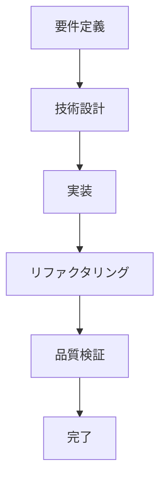

# 開発ワークフローガイド

このドキュメントは、履修管理システムの開発における標準的なワークフローと各フェーズでの作業内容を説明します。

## 開発フェーズ概要



## Phase 1: 要件定義

### 目的
ビジネス要件を明確化し、ユーザーストーリーと受け入れ条件を定義する。

### 成果物
- ユーザーストーリー（AS A / I WANT TO / SO THAT形式）
- 受け入れ条件（Given-When-Then形式）
- ビジネスルールとエッジケース

### 例: 履修登録提出機能
```markdown
## ユーザーストーリー
AS A 学生
I WANT TO 履修登録を提出する
SO THAT アドバイザーの承認を受けられる

## 受け入れ条件
### AC1: 12単位以上の履修登録を提出できる（最重要）
Given: 12単位分の科目が登録されたDraft状態のセッション
When: 学生が提出を実行
Then: セッションがSubmitted状態になる

### AC2: 12単位未満では提出できない
Given: 11単位分の科目が登録されたDraft状態のセッション
When: 学生が提出を試行
Then: MinUnitsNotMetエラーが発生する

### AC3: Draft状態以外では提出できない
Given: Submitted状態のセッション
When: 学生が再提出を試行
Then: InvalidSessionStateエラーが発生する
```

## Phase 2: 技術設計

### 目的
ビジネス要件をCQRS/イベントソーシングの技術設計に変換し、実装タスクに分解する。

### 成果物
- ドメインイベント仕様
- ドメインエラー仕様
- 実装タスクリスト（優先順位付き）
- 関数シグネチャ設計

### 例: 技術設計書
```markdown
## ドメインイベント
- RegistrationSessionSubmitted

## ドメインエラー
- MinUnitsNotMet
- InvalidSessionState

## 実装タスク（AcceptanceTDD）
### Phase 1: 基本正常系
1. AC1の受け入れテスト作成（他はskip）
2. RegistrationSessionSubmittedイベント実装
3. submitRegistrationSessionドメインロジック実装
4. アプリケーションコマンド実装

### Phase 2: 主要異常系
5. AC2のテスト有効化
6. MinUnitsNotMetエラー実装
7. validateMinimumUnits関数実装

### Phase 3: エッジケース
8. AC3のテスト有効化
9. 状態遷移バリデーション強化
```

## Phase 3: 実装（AcceptanceTDD）

### 目的
設計に基づき、TDDサイクルで段階的に機能を実装する。

### 作業手順

#### Step 1: 失敗するテストの作成
```typescript
// tests/stories/session-submission.acceptance.test.ts
describe("ストーリー3: 履修登録提出", () => {
  it("12単位以上の履修登録を提出できる", () =>
    Effect.gen(function* () {
      // テスト実装
    }).pipe(Effect.provide(TestLayer)).pipe(Effect.runPromise)
  );

  it.skip("12単位未満では提出できない", () => {
    // 後で実装
  });
});
```

#### Step 2: 最小限の実装
```typescript
// ドメインイベント
export class RegistrationSessionSubmitted extends Data.TaggedClass("RegistrationSessionSubmitted")<{
  readonly sessionId: RegistrationSessionId;
  readonly submittedAt: Date;
}> {}

// ドメインロジック
export const submitRegistrationSession = (session: RegistrationSession) =>
  Effect.gen(function* () {
    yield* validateDraftState(session);
    yield* validateMinimumUnits(session);
    
    return new RegistrationSessionSubmitted({
      sessionId: session.id,
      submittedAt: new Date()
    });
  });
```

#### Step 3: リファクタリング
- コードの重複を除去
- 命名の改善
- 型安全性の向上

## Phase 4: リファクタリング

### 目的
実装されたコードの品質を向上させ、保守性を高める。

### 重点項目
- 重複コードの共通化
- テストヘルパーの改善
- パフォーマンス最適化
- 技術的負債の解消

### 例: 共通バリデーション関数
```typescript
// Before: 重複したバリデーション
yield* session.status._tag === "Draft" 
  ? Effect.void 
  : Effect.fail(new InvalidSessionState({...}));

// After: 共通関数化
export const validateSessionState = (
  session: RegistrationSession,
  expectedState: string,
  action: string
) => // 実装
```

## Phase 5: 品質検証

### 目的
実装の品質を検証し、必要な改善を特定する。

### チェック項目
- テスト網羅性（受け入れ条件のカバー）
- エッジケース・境界値テスト
- カバレッジ（90%以上）
- TypeScriptエラー（0であること）
- Effect-TSパターンの遵守

### 品質レポート例
```markdown
## 品質検証レポート

### カバレッジ
- 全体: 92.5% ✅
- ドメイン層: 95.0% ✅
- アプリケーション層: 90.0% ✅

### 改善提案
1. 境界値テスト追加（20単位、21単位のケース）
2. 並行提出時の競合状態テスト
3. タイムスタンプの妥当性検証
```

## 実装進行管理

### Git操作
```bash
# フェーズ毎のコミット
git add .
git commit -m "feat(story3): implement Phase 1 - basic submission flow"

# 進捗確認
git log --oneline -n 10
```

### 進捗追跡
- 各フェーズ完了時にコミット
- `it.skip()` → `it()` の変更履歴
- テスト実行結果の記録

## ベストプラクティス

### DO
- ✅ 段階的に実装を進める
- ✅ 各フェーズで品質を確認する
- ✅ ドメインロジックをドメイン層に配置する
- ✅ カスタムアサーションを活用する
- ✅ Effect-TSパターンを一貫して使用する

### DON'T
- ❌ 一度に全機能を実装する
- ❌ テストなしで実装を進める
- ❌ アプリケーション層にビジネスロジックを書く
- ❌ try-catchでエラーハンドリングする
- ❌ 既存のアーキテクチャパターンから逸脱する

## トラブルシューティング

### よくある問題と対処法

#### 問題: テストが予期せず失敗する
```bash
# 原因調査
npm run test -- --reporter=verbose

# 特定のテストのみ実行
npm run test tests/stories/specific-test.test.ts
```

#### 問題: TypeScriptエラーが解決しない
```bash
# 型チェック詳細
npm run typecheck -- --listFiles

# キャッシュクリア
rm -rf node_modules/.cache
npm run typecheck
```

#### 問題: カバレッジが低下した
```bash
# カバレッジ詳細確認
npm run test:coverage

# HTMLレポート確認
open coverage/index.html
```

## 継続的改善

### 振り返りポイント
- ストーリー完了後の振り返り
- 週次での進捗確認
- 月次での全体最適化

### 改善の記録
- 成功パターンの文書化
- 失敗事例と対策の記録
- プロセス改善の提案

このワークフローに従うことで、品質を維持しながら効率的に開発を進めることができます。