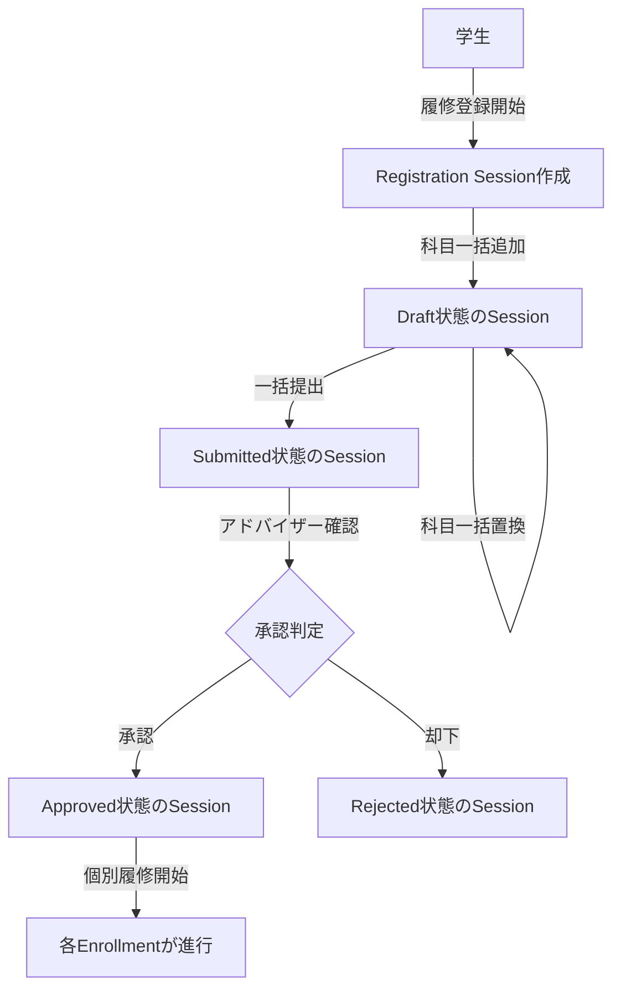

# 履修管理システム - Effect-TS CQRS/イベントソーシング実装ガイド（一括操作版）

## 概要

このドキュメントでは、Effect-TSを用いた関数型DDD、CQRS、イベントソーシングによる履修管理システムの実装方法を説明します。科目の追加・削除は一括操作として実装され、実用的な履修管理システムとしてのパフォーマンスと保守性を重視した設計となっています。

## 更新履歴

- **2025-07-22**: 一括操作版の実装ガイドを初回作成
- Effect-TSによる関数型アプローチの採用
- CQRS/イベントソーシングパターンの実装
- 一括操作によるパフォーマンス最適化

### アーキテクチャの特徴

- **CQRS (Command Query Responsibility Segregation)**: コマンド（書き込み）とクエリ（読み込み）を分離
- **イベントソーシング**: 状態変更をイベントとして記録（Update禁止、Insertのみ）
- **関数型DDD**: Effect-TSによる型安全で副作用管理された実装
- **履修ライフサイクル管理**: 明確な状態遷移とビジネスルールの実装
- **3層データベース構造**: Write Model（履修集約 + イベント）とRead Model（投影）の分離
- **一括操作**: 科目の追加・削除は常に一括で実行（パフォーマンス最適化）
- **型安全性**: Effect-TSのBrand型による実行時エラーの防止
- **トランザクション整合性**: イベントストアレベルでのACID特性保証

### システムの主要な集約

1. **RegistrationSession（履修登録セッション）**: 学期ごとの履修登録を管理
2. **Enrollment（個別履修）**: 個々の科目履修を管理

### 履修登録の全体フロー



## 1. ドメイン層: 履修登録セッションと履修エンティティ

### src/domain/registration/registration-session.ts

```typescript
import { Schema, Effect, Context, Brand, Data, Option } from "effect";
import { StudentId, CourseId, Term, EnrollmentId } from "./enrollment";

// --- 履修登録セッションID ---
export type RegistrationSessionId = string & Brand.Brand<"RegistrationSessionId">;

const RegistrationSessionIdSchema = Schema.String.pipe(
  Schema.pattern(/^RS\d{8}$/, {
    message: () => "セッションIDは'RS'で始まる10文字である必要があります"
  }),
  Schema.brand("RegistrationSessionId")
);

export const RegistrationSessionId = Schema.decode(RegistrationSessionIdSchema);

// セッションIDの生成
export const createRegistrationSessionId = (
  studentId: StudentId,
  term: Term
): RegistrationSessionId => {
  // 実際は連番やUUIDを使用
  const timestamp = Date.now().toString().slice(-8);
  return `RS${timestamp}` as RegistrationSessionId;
};

// --- 履修登録セッション状態 ---
export const RegistrationSessionStatus = Schema.Literal(
  "Draft",      // 下書き（科目の追加・削除可能）
  "Submitted",  // 提出済み（承認待ち）
  "Approved",   // 承認済み
  "Rejected"    // 却下
);
export type RegistrationSessionStatus = Schema.Schema.Type<typeof RegistrationSessionStatus>;

// --- 科目情報 ---
export interface CourseInfo {
  readonly courseId: CourseId;
  readonly units: number;
}

// --- 履修登録セッション集約 ---
export class RegistrationSession extends Data.Class<{
  readonly id: RegistrationSessionId;
  readonly studentId: StudentId;
  readonly term: Term;
  readonly enrollments: ReadonlyArray<{
    enrollmentId: EnrollmentId;
    courseId: CourseId;
    units: number;
  }>;
  readonly status: RegistrationSessionStatus;
  readonly totalUnits: number;
  readonly version: number;
}> {}

// --- ドメインイベント（セッション関連） ---
export class RegistrationSessionCreated extends Data.TaggedClass("RegistrationSessionCreated")<{
  readonly sessionId: RegistrationSessionId;
  readonly studentId: StudentId;
  readonly term: Term;
  readonly createdAt: Date;
}> {}

export class CoursesAddedToSession extends Data.TaggedClass("CoursesAddedToSession")<{
  readonly sessionId: RegistrationSessionId;
  readonly courses: ReadonlyArray<{
    enrollmentId: EnrollmentId;
    courseId: CourseId;
    units: number;
  }>;
  readonly totalUnitsAfter: number;
  readonly addedAt: Date;
}> {}

export class CoursesRemovedFromSession extends Data.TaggedClass("CoursesRemovedFromSession")<{
  readonly sessionId: RegistrationSessionId;
  readonly enrollmentIds: ReadonlyArray<EnrollmentId>;
  readonly totalUnitsAfter: number;
  readonly removedAt: Date;
}> {}

export class SessionCoursesReplaced extends Data.TaggedClass("SessionCoursesReplaced")<{
  readonly sessionId: RegistrationSessionId;
  readonly newCourses: ReadonlyArray<{
    enrollmentId: EnrollmentId;
    courseId: CourseId;
    units: number;
  }>;
  readonly totalUnits: number;
  readonly replacedAt: Date;
}> {}

export class RegistrationSessionSubmitted extends Data.TaggedClass("RegistrationSessionSubmitted")<{
  readonly sessionId: RegistrationSessionId;
  readonly enrollmentIds: ReadonlyArray<EnrollmentId>;
  readonly totalUnits: number;
  readonly submittedAt: Date;
}> {}

export class RegistrationSessionApproved extends Data.TaggedClass("RegistrationSessionApproved")<{
  readonly sessionId: RegistrationSessionId;
  readonly approvedBy: string;
  readonly approvedAt: Date;
}> {}

export class RegistrationSessionRejected extends Data.TaggedClass("RegistrationSessionRejected")<{
  readonly sessionId: RegistrationSessionId;
  readonly rejectedBy: string;
  readonly reason: string;
  readonly rejectedAt: Date;
}> {}

export type RegistrationSessionEvent =
  | RegistrationSessionCreated
  | CoursesAddedToSession
  | CoursesRemovedFromSession
  | SessionCoursesReplaced
  | RegistrationSessionSubmitted
  | RegistrationSessionApproved
  | RegistrationSessionRejected;

// --- ドメインエラー（セッション関連） ---
export class InvalidSessionState extends Data.TaggedError("InvalidSessionState")<{
  readonly sessionId: RegistrationSessionId;
  readonly currentState: RegistrationSessionStatus;
  readonly attemptedAction: string;
}> {}

export class MaxUnitsExceeded extends Data.TaggedError("MaxUnitsExceeded")<{
  readonly currentUnits: number;
  readonly requestedUnits: number;
  readonly maxUnits: number;
}> {}

export class DuplicateCourseInSession extends Data.TaggedError("DuplicateCourseInSession")<{
  readonly sessionId: RegistrationSessionId;
  readonly courseIds: ReadonlyArray<CourseId>;
}> {}

export class SessionNotFound extends Data.TaggedError("SessionNotFound")<{
  readonly sessionId: RegistrationSessionId;
}> {}

export class MinUnitsNotMet extends Data.TaggedError("MinUnitsNotMet")<{
  readonly currentUnits: number;
  readonly minUnits: number;
}> {}

// --- ビジネスルール定数 ---
export const MAX_UNITS_PER_TERM = 20;
export const MIN_UNITS_PER_TERM = 12;

// --- ドメインロジック（一括操作） ---

// 科目の一括追加
export const addCoursesToSession = (
  session: RegistrationSession,
  courses: ReadonlyArray<CourseInfo>
): Effect.Effect<readonly [RegistrationSession, ReadonlyArray<RegistrationSessionEvent>], InvalidSessionState | MaxUnitsExceeded | DuplicateCourseInSession> => {
  if (session.status !== "Draft") {
    return Effect.fail(new InvalidSessionState({
      sessionId: session.id,
      currentState: session.status,
      attemptedAction: "addCourses"
    }));
  }

  // 重複チェック
  const existingCourseIds = new Set(session.enrollments.map(e => e.courseId));
  const duplicates = courses.filter(c => existingCourseIds.has(c.courseId));
  if (duplicates.length > 0) {
    return Effect.fail(new DuplicateCourseInSession({
      sessionId: session.id,
      courseIds: duplicates.map(d => d.courseId)
    }));
  }

  // 単位数チェック
  const additionalUnits = courses.reduce((sum, c) => sum + c.units, 0);
  const newTotalUnits = session.totalUnits + additionalUnits;
  if (newTotalUnits > MAX_UNITS_PER_TERM) {
    return Effect.fail(new MaxUnitsExceeded({
      currentUnits: session.totalUnits,
      requestedUnits: additionalUnits,
      maxUnits: MAX_UNITS_PER_TERM
    }));
  }

  // 新しい履修エントリの作成
  const newEnrollments = courses.map(course => ({
    enrollmentId: createEnrollmentId(session.studentId, course.courseId, session.term),
    courseId: course.courseId,
    units: course.units
  }));

  const updatedSession = new RegistrationSession({
    ...session,
    enrollments: [...session.enrollments, ...newEnrollments],
    totalUnits: newTotalUnits,
    version: session.version + 1
  });

  const event = new CoursesAddedToSession({
    sessionId: session.id,
    courses: newEnrollments,
    totalUnitsAfter: newTotalUnits,
    addedAt: new Date()
  });

  return Effect.succeed([updatedSession, [event]]);
};

// 科目の一括削除
export const removeCoursesFromSession = (
  session: RegistrationSession,
  enrollmentIds: ReadonlyArray<EnrollmentId>
): Effect.Effect<readonly [RegistrationSession, ReadonlyArray<RegistrationSessionEvent>], InvalidSessionState> => {
  if (session.status !== "Draft") {
    return Effect.fail(new InvalidSessionState({
      sessionId: session.id,
      currentState: session.status,
      attemptedAction: "removeCourses"
    }));
  }

  const idsToRemove = new Set(enrollmentIds);
  const remainingEnrollments = session.enrollments.filter(e => !idsToRemove.has(e.enrollmentId));
  const removedEnrollments = session.enrollments.filter(e => idsToRemove.has(e.enrollmentId));

  const removedUnits = removedEnrollments.reduce((sum, e) => sum + e.units, 0);
  const newTotalUnits = session.totalUnits - removedUnits;

  const updatedSession = new RegistrationSession({
    ...session,
    enrollments: remainingEnrollments,
    totalUnits: newTotalUnits,
    version: session.version + 1
  });

  const event = new CoursesRemovedFromSession({
    sessionId: session.id,
    enrollmentIds,
    totalUnitsAfter: newTotalUnits,
    removedAt: new Date()
  });

  return Effect.succeed([updatedSession, [event]]);
};

// 科目の一括置換（全削除して新規追加）
export const replaceAllCoursesInSession = (
  session: RegistrationSession,
  newCourses: ReadonlyArray<CourseInfo>
): Effect.Effect<readonly [RegistrationSession, ReadonlyArray<RegistrationSessionEvent>], InvalidSessionState | MaxUnitsExceeded> => {
  if (session.status !== "Draft") {
    return Effect.fail(new InvalidSessionState({
      sessionId: session.id,
      currentState: session.status,
      attemptedAction: "replaceAllCourses"
    }));
  }

  // 単位数チェック
  const newTotalUnits = newCourses.reduce((sum, c) => sum + c.units, 0);
  if (newTotalUnits > MAX_UNITS_PER_TERM) {
    return Effect.fail(new MaxUnitsExceeded({
      currentUnits: 0,
      requestedUnits: newTotalUnits,
      maxUnits: MAX_UNITS_PER_TERM
    }));
  }

  // 新しい履修エントリの作成
  const newEnrollments = newCourses.map(course => ({
    enrollmentId: createEnrollmentId(session.studentId, course.courseId, session.term),
    courseId: course.courseId,
    units: course.units
  }));

  const updatedSession = new RegistrationSession({
    ...session,
    enrollments: newEnrollments,
    totalUnits: newTotalUnits,
    version: session.version + 1
  });

  const event = new SessionCoursesReplaced({
    sessionId: session.id,
    newCourses: newEnrollments,
    totalUnits: newTotalUnits,
    replacedAt: new Date()
  });

  return Effect.succeed([updatedSession, [event]]);
};

// セッションの提出
export const submitSession = (
  session: RegistrationSession
): Effect.Effect<readonly [RegistrationSession, ReadonlyArray<RegistrationSessionEvent>], InvalidSessionState | MinUnitsNotMet> => {
  if (session.status !== "Draft") {
    return Effect.fail(new InvalidSessionState({
      sessionId: session.id,
      currentState: session.status,
      attemptedAction: "submit"
    }));
  }

  // 最小単位数チェック
  if (session.totalUnits < MIN_UNITS_PER_TERM) {
    return Effect.fail(new MinUnitsNotMet({
      currentUnits: session.totalUnits,
      minUnits: MIN_UNITS_PER_TERM
    }));
  }

  const updatedSession = new RegistrationSession({
    ...session,
    status: "Submitted",
    version: session.version + 1
  });

  const event = new RegistrationSessionSubmitted({
    sessionId: session.id,
    enrollmentIds: session.enrollments.map(e => e.enrollmentId),
    totalUnits: session.totalUnits,
    submittedAt: new Date()
  });

  return Effect.succeed([updatedSession, [event]]);
};

// --- リポジトリインターフェース ---
export interface RegistrationSessionRepository {
  readonly findById: (id: RegistrationSessionId) => Effect.Effect<Option.Option<RegistrationSession>, never>;
  readonly findByStudentAndTerm: (studentId: StudentId, term: Term) => Effect.Effect<Option.Option<RegistrationSession>, never>;
}
export const RegistrationSessionRepository = Context.Tag<RegistrationSessionRepository>("@app/RegistrationSessionRepository");
```

### src/domain/enrollment/enrollment.ts

```typescript
import { Schema, Effect, Context, Brand, Data, Option } from "effect";

// --- 値オブジェクト ---
export type StudentId = string & Brand.Brand<"StudentId">;

const StudentIdSchema = Schema.String.pipe(
  Schema.pattern(/^S\d{8}$/, { message: () => "学生IDは'S'で始まる9文字である必要があります" }),
  Schema.brand("StudentId")
);

export const StudentId = Schema.decode(StudentIdSchema);

export type CourseId = string & Brand.Brand<"CourseId">;

const CourseIdSchema = Schema.String.pipe(
  Schema.pattern(/^C\d{6}$/, { message: () => "コースIDは'C'で始まる7文字である必要があります" }),
  Schema.brand("CourseId")
);

export const CourseId = Schema.decode(CourseIdSchema);

export type Term = string & Brand.Brand<"Term">;

const TermSchema = Schema.String.pipe(
  Schema.pattern(/^\d{4}-(Spring|Fall|Summer)$/, { message: () => "学期は'YYYY-Spring/Fall/Summer'形式である必要があります" }),
  Schema.brand("Term")
);

export const Term = Schema.decode(TermSchema);

// 複合IDとしてのEnrollmentId（StudentId:CourseId:Term）
export type EnrollmentId = string & Brand.Brand<"EnrollmentId">;

export const createEnrollmentId = (
  studentId: StudentId,
  courseId: CourseId,
  term: Term
): EnrollmentId => {
  return `${studentId}:${courseId}:${term}` as EnrollmentId;
};

export const parseEnrollmentId = (
  enrollmentId: EnrollmentId
): { studentId: StudentId; courseId: CourseId; term: Term } => {
  const [studentId, courseId, term] = enrollmentId.split(':');
  return {
    studentId: studentId as StudentId,
    courseId: courseId as CourseId,
    term: term as Term
  };
};

// 成績の定義
export const Grade = Schema.Literal("A", "B", "C", "D", "F", "W", "I", "P");
export type Grade = Schema.Schema.Type<typeof Grade>;

// --- 履修状態（簡略化） ---
export const EnrollmentStatus = Schema.Literal(
  "Requested",   // リクエスト済み（セッション内）
  "Approved",    // 承認済み
  "InProgress",  // 履修中
  "Completed",   // 完了
  "Cancelled",   // キャンセル
  "Withdrawn"    // 離脱
);
export type EnrollmentStatus = Schema.Schema.Type<typeof EnrollmentStatus>;

// --- 履修エンティティ ---
export class Enrollment extends Data.Class<{
  readonly id: EnrollmentId;
  readonly sessionId: RegistrationSessionId;  // 所属するセッション
  readonly studentId: StudentId;
  readonly courseId: CourseId;
  readonly term: Term;
  readonly status: EnrollmentStatus;
  readonly grade: Option.Option<Grade>;
  readonly version: number;
}> {}

// --- ドメインイベント（履修関連） ---
export class EnrollmentsRequestedBatch extends Data.TaggedClass("EnrollmentsRequestedBatch")<{
  readonly sessionId: RegistrationSessionId;
  readonly enrollments: ReadonlyArray<{
    enrollmentId: EnrollmentId;
    studentId: StudentId;
    courseId: CourseId;
    term: Term;
  }>;
  readonly requestedAt: Date;
}> {}

export class EnrollmentsCancelledBatch extends Data.TaggedClass("EnrollmentsCancelledBatch")<{
  readonly sessionId: RegistrationSessionId;
  readonly enrollmentIds: ReadonlyArray<EnrollmentId>;
  readonly reason: string;
  readonly cancelledAt: Date;
}> {}

export class EnrollmentsApprovedBatch extends Data.TaggedClass("EnrollmentsApprovedBatch")<{
  readonly sessionId: RegistrationSessionId;
  readonly enrollmentIds: ReadonlyArray<EnrollmentId>;
  readonly approvedAt: Date;
}> {}

// 個別の履修進行イベント（これらは個別に発生）
export class EnrollmentStarted extends Data.TaggedClass("EnrollmentStarted")<{
  readonly enrollmentId: EnrollmentId;
  readonly startedAt: Date;
}> {}

export class EnrollmentCompleted extends Data.TaggedClass("EnrollmentCompleted")<{
  readonly enrollmentId: EnrollmentId;
  readonly grade: Grade;
  readonly completedAt: Date;
}> {}

export class EnrollmentWithdrawn extends Data.TaggedClass("EnrollmentWithdrawn")<{
  readonly enrollmentId: EnrollmentId;
  readonly withdrawnAt: Date;
}> {}

export type EnrollmentEvent =
  | EnrollmentsRequestedBatch
  | EnrollmentsCancelledBatch
  | EnrollmentsApprovedBatch
  | EnrollmentStarted
  | EnrollmentCompleted
  | EnrollmentWithdrawn;

// すべてのドメインイベント
export type DomainEvent = RegistrationSessionEvent | EnrollmentEvent;

// --- ドメインエラー ---
export class InvalidEnrollmentTransition extends Data.TaggedError("InvalidEnrollmentTransition")<{
  readonly enrollmentId: EnrollmentId;
  readonly currentState: EnrollmentStatus;
  readonly attemptedTransition: string;
}> {}

export class EnrollmentNotFound extends Data.TaggedError("EnrollmentNotFound")<{
  readonly enrollmentId: EnrollmentId;
}> {}

export type DomainError =
  | InvalidSessionState
  | MaxUnitsExceeded
  | MinUnitsNotMet
  | DuplicateCourseInSession
  | SessionNotFound
  | InvalidEnrollmentTransition
  | EnrollmentNotFound;

// --- リポジトリインターフェース ---
export interface EnrollmentRepository {
  readonly findById: (id: EnrollmentId) => Effect.Effect<Option.Option<Enrollment>, never>;
  readonly findBySessionId: (sessionId: RegistrationSessionId) => Effect.Effect<ReadonlyArray<Enrollment>, never>;
  readonly findByStudentAndTerm: (studentId: StudentId, term: Term) => Effect.Effect<ReadonlyArray<Enrollment>, never>;
}
export const EnrollmentRepository = Context.Tag<EnrollmentRepository>("@app/EnrollmentRepository");

// --- イベントストア ---
export class EventStoreError extends Data.TaggedError("EventStoreError")<{
  readonly cause: unknown;
}> {}

export interface EventStore {
  // セッションの作成
  readonly createSession: (
    sessionId: RegistrationSessionId,
    studentId: StudentId,
    term: Term,
    events: ReadonlyArray<DomainEvent>
  ) => Effect.Effect<void, EventStoreError>;

  // 履修の一括作成（セッションに紐付け）
  readonly createEnrollmentsBatch: (
    sessionId: RegistrationSessionId,
    enrollments: ReadonlyArray<{
      enrollmentId: EnrollmentId;
      studentId: StudentId;
      courseId: CourseId;
      term: Term;
    }>,
    events: ReadonlyArray<DomainEvent>
  ) => Effect.Effect<void, EventStoreError>;

  // 既存エンティティへのイベント追加
  readonly appendEvents: (
    events: ReadonlyArray<DomainEvent>
  ) => Effect.Effect<void, EventStoreError>;

  // イベントの取得
  readonly getSessionEvents: (sessionId: RegistrationSessionId) => Effect.Effect<ReadonlyArray<DomainEvent>, EventStoreError>;
  readonly getEnrollmentEvents: (enrollmentId: EnrollmentId) => Effect.Effect<ReadonlyArray<DomainEvent>, EventStoreError>;
}
export const EventStore = Context.Tag<EventStore>("@app/EventStore");

// --- イベント投影 ---
export interface EventProjector {
  readonly project: (events: ReadonlyArray<DomainEvent>) => Effect.Effect<void, never>;
}
export const EventProjector = Context.Tag<EventProjector>("@app/EventProjector");

// --- イベントバス ---
export interface EventBus {
  readonly publish: (events: ReadonlyArray<DomainEvent>) => Effect.Effect<void, never>;
  readonly subscribe: (handler: (event: DomainEvent) => Effect.Effect<void, never>) => Effect.Effect<void, never>;
}
export const EventBus = Context.Tag<EventBus>("@app/EventBus");
```

## 2. アプリケーション層: コマンドとクエリ

### src/application/commands.ts

```typescript
import { Effect, Option } from "effect";
import * as Domain from "../domain";

type CommandError = Domain.DomainError | Domain.EventStoreError;

// --- 履修登録セッションコマンド ---

// セッションの作成
export const createRegistrationSessionCommand = (
  studentId: Domain.StudentId,
  term: Domain.Term
): Effect.Effect<Domain.RegistrationSessionId, CommandError, Domain.EventStore | Domain.RegistrationSessionRepository> =>
  Effect.gen(function* () {
    const eventStore = yield* Domain.EventStore;
    const repo = yield* Domain.RegistrationSessionRepository;

    // 既存セッションのチェック
    const existingSession = yield* repo.findByStudentAndTerm(studentId, term);
    if (Option.isSome(existingSession)) {
      return existingSession.value.id;  // 既存のセッションを返す
    }

    const sessionId = Domain.createRegistrationSessionId(studentId, term);

    const event = new Domain.RegistrationSessionCreated({
      sessionId,
      studentId,
      term,
      createdAt: new Date()
    });

    yield* eventStore.createSession(sessionId, studentId, term, [event]);

    return sessionId;
  });

// セッションに科目を一括追加
export const addCoursesToSessionCommand = (
  sessionId: Domain.RegistrationSessionId,
  courses: ReadonlyArray<Domain.CourseInfo>
): Effect.Effect<ReadonlyArray<Domain.EnrollmentId>, CommandError, Domain.EventStore | Domain.RegistrationSessionRepository> =>
  Effect.gen(function* () {
    const eventStore = yield* Domain.EventStore;
    const repo = yield* Domain.RegistrationSessionRepository;

    // セッションの取得
    const sessionOption = yield* repo.findById(sessionId);
    const session = yield* Effect.fromOption(sessionOption, () =>
      new Domain.SessionNotFound({ sessionId })
    );

    // ドメインロジックの実行
    const [updatedSession, sessionEvents] = yield* Domain.addCoursesToSession(session, courses);

    // 履修エンティティの作成情報
    const enrollmentData = courses.map(course => ({
      enrollmentId: Domain.createEnrollmentId(session.studentId, course.courseId, session.term),
      studentId: session.studentId,
      courseId: course.courseId,
      term: session.term
    }));

    // 履修作成イベント
    const enrollmentEvent = new Domain.EnrollmentsRequestedBatch({
      sessionId,
      enrollments: enrollmentData,
      requestedAt: new Date()
    });

    // 履修エンティティとイベントの保存
    yield* eventStore.createEnrollmentsBatch(
      sessionId,
      enrollmentData,
      [...sessionEvents, enrollmentEvent]
    );

    return enrollmentData.map(e => e.enrollmentId);
  });

// セッションから科目を一括削除
export const removeCoursesFromSessionCommand = (
  sessionId: Domain.RegistrationSessionId,
  enrollmentIds: ReadonlyArray<Domain.EnrollmentId>
): Effect.Effect<void, CommandError, Domain.EventStore | Domain.RegistrationSessionRepository> =>
  Effect.gen(function* () {
    const eventStore = yield* Domain.EventStore;
    const repo = yield* Domain.RegistrationSessionRepository;

    const sessionOption = yield* repo.findById(sessionId);
    const session = yield* Effect.fromOption(sessionOption, () =>
      new Domain.SessionNotFound({ sessionId })
    );

    const [updatedSession, sessionEvents] = yield* Domain.removeCoursesFromSession(session, enrollmentIds);

    const cancelledEvent = new Domain.EnrollmentsCancelledBatch({
      sessionId,
      enrollmentIds,
      reason: "Removed from registration session",
      cancelledAt: new Date()
    });

    yield* eventStore.appendEvents([...sessionEvents, cancelledEvent]);
  });

// セッションの科目を全置換
export const replaceAllCoursesInSessionCommand = (
  sessionId: Domain.RegistrationSessionId,
  newCourses: ReadonlyArray<Domain.CourseInfo>
): Effect.Effect<ReadonlyArray<Domain.EnrollmentId>, CommandError, Domain.EventStore | Domain.RegistrationSessionRepository | Domain.EnrollmentRepository> =>
  Effect.gen(function* () {
    const eventStore = yield* Domain.EventStore;
    const sessionRepo = yield* Domain.RegistrationSessionRepository;
    const enrollmentRepo = yield* Domain.EnrollmentRepository;

    const sessionOption = yield* sessionRepo.findById(sessionId);
    const session = yield* Effect.fromOption(sessionOption, () =>
      new Domain.SessionNotFound({ sessionId })
    );

    // 既存の履修を取得
    const existingEnrollments = yield* enrollmentRepo.findBySessionId(sessionId);
    const existingEnrollmentIds = existingEnrollments.map(e => e.id);

    // ドメインロジックの実行
    const [updatedSession, sessionEvents] = yield* Domain.replaceAllCoursesInSession(session, newCourses);

    // 新しい履修エンティティの作成情報
    const enrollmentData = newCourses.map(course => ({
      enrollmentId: Domain.createEnrollmentId(session.studentId, course.courseId, session.term),
      studentId: session.studentId,
      courseId: course.courseId,
      term: session.term
    }));

    // 既存履修のキャンセルイベント（もしあれば）
    const events: Domain.DomainEvent[] = [...sessionEvents];
    if (existingEnrollmentIds.length > 0) {
      events.push(new Domain.EnrollmentsCancelledBatch({
        sessionId,
        enrollmentIds: existingEnrollmentIds,
        reason: "Replaced by new course selection",
        cancelledAt: new Date()
      }));
    }

    // 新規履修の作成イベント
    events.push(new Domain.EnrollmentsRequestedBatch({
      sessionId,
      enrollments: enrollmentData,
      requestedAt: new Date()
    }));

    // 履修エンティティとイベントの保存
    yield* eventStore.createEnrollmentsBatch(
      sessionId,
      enrollmentData,
      events
    );

    return enrollmentData.map(e => e.enrollmentId);
  });

// セッションの一括提出
export const submitRegistrationSessionCommand = (
  sessionId: Domain.RegistrationSessionId
): Effect.Effect<void, CommandError, Domain.EventStore | Domain.RegistrationSessionRepository> =>
  Effect.gen(function* () {
    const eventStore = yield* Domain.EventStore;
    const repo = yield* Domain.RegistrationSessionRepository;

    const sessionOption = yield* repo.findById(sessionId);
    const session = yield* Effect.fromOption(sessionOption, () =>
      new Domain.SessionNotFound({ sessionId })
    );

    const [updatedSession, events] = yield* Domain.submitSession(session);

    yield* eventStore.appendEvents(events);
  });

// セッションの承認（アドバイザー）
export const approveRegistrationSessionCommand = (
  sessionId: Domain.RegistrationSessionId,
  approvedBy: string
): Effect.Effect<void, CommandError, Domain.EventStore | Domain.RegistrationSessionRepository | Domain.EnrollmentRepository> =>
  Effect.gen(function* () {
    const eventStore = yield* Domain.EventStore;
    const sessionRepo = yield* Domain.RegistrationSessionRepository;
    const enrollmentRepo = yield* Domain.EnrollmentRepository;

    const sessionOption = yield* sessionRepo.findById(sessionId);
    const session = yield* Effect.fromOption(sessionOption, () =>
      new Domain.SessionNotFound({ sessionId })
    );

    if (session.status !== "Submitted") {
      return yield* Effect.fail(new Domain.InvalidSessionState({
        sessionId: session.id,
        currentState: session.status,
        attemptedAction: "approve"
      }));
    }

    // セッション承認イベント
    const sessionApprovedEvent = new Domain.RegistrationSessionApproved({
      sessionId,
      approvedBy,
      approvedAt: new Date()
    });

    // 履修の一括承認イベント
    const enrollments = yield* enrollmentRepo.findBySessionId(sessionId);
    const enrollmentApprovedEvent = new Domain.EnrollmentsApprovedBatch({
      sessionId,
      enrollmentIds: enrollments.map(e => e.id),
      approvedAt: new Date()
    });

    yield* eventStore.appendEvents([sessionApprovedEvent, enrollmentApprovedEvent]);
  });

// セッションの却下（アドバイザー）
export const rejectRegistrationSessionCommand = (
  sessionId: Domain.RegistrationSessionId,
  rejectedBy: string,
  reason: string
): Effect.Effect<void, CommandError, Domain.EventStore | Domain.RegistrationSessionRepository | Domain.EnrollmentRepository> =>
  Effect.gen(function* () {
    const eventStore = yield* Domain.EventStore;
    const sessionRepo = yield* Domain.RegistrationSessionRepository;
    const enrollmentRepo = yield* Domain.EnrollmentRepository;

    const sessionOption = yield* sessionRepo.findById(sessionId);
    const session = yield* Effect.fromOption(sessionOption, () =>
      new Domain.SessionNotFound({ sessionId })
    );

    if (session.status !== "Submitted") {
      return yield* Effect.fail(new Domain.InvalidSessionState({
        sessionId: session.id,
        currentState: session.status,
        attemptedAction: "reject"
      }));
    }

    // セッション却下イベント
    const sessionRejectedEvent = new Domain.RegistrationSessionRejected({
      sessionId,
      rejectedBy,
      reason,
      rejectedAt: new Date()
    });

    // 履修の一括キャンセルイベント
    const enrollments = yield* enrollmentRepo.findBySessionId(sessionId);
    const enrollmentCancelledEvent = new Domain.EnrollmentsCancelledBatch({
      sessionId,
      enrollmentIds: enrollments.map(e => e.id),
      reason: `Session rejected: ${reason}`,
      cancelledAt: new Date()
    });

    yield* eventStore.appendEvents([sessionRejectedEvent, enrollmentCancelledEvent]);
  });

// --- 個別履修コマンド（セッション承認後の操作） ---

// 履修開始（学期開始時）
export const startEnrollmentCommand = (
  enrollmentId: Domain.EnrollmentId
): Effect.Effect<void, CommandError, Domain.EventStore | Domain.EnrollmentRepository> =>
  Effect.gen(function* () {
    const eventStore = yield* Domain.EventStore;
    const repo = yield* Domain.EnrollmentRepository;

    const enrollmentOption = yield* repo.findById(enrollmentId);
    const enrollment = yield* Effect.fromOption(enrollmentOption, () =>
      new Domain.EnrollmentNotFound({ enrollmentId })
    );

    if (enrollment.status !== "Approved") {
      return yield* Effect.fail(new Domain.InvalidEnrollmentTransition({
        enrollmentId,
        currentState: enrollment.status,
        attemptedTransition: "start"
      }));
    }

    const event = new Domain.EnrollmentStarted({
      enrollmentId,
      startedAt: new Date()
    });

    yield* eventStore.appendEvents([event]);
  });

// 履修完了（成績付与）
export const completeEnrollmentCommand = (
  enrollmentId: Domain.EnrollmentId,
  grade: Domain.Grade
): Effect.Effect<void, CommandError, Domain.EventStore | Domain.EnrollmentRepository> =>
  Effect.gen(function* () {
    const eventStore = yield* Domain.EventStore;
    const repo = yield* Domain.EnrollmentRepository;

    const enrollmentOption = yield* repo.findById(enrollmentId);
    const enrollment = yield* Effect.fromOption(enrollmentOption, () =>
      new Domain.EnrollmentNotFound({ enrollmentId })
    );

    if (enrollment.status !== "InProgress") {
      return yield* Effect.fail(new Domain.InvalidEnrollmentTransition({
        enrollmentId,
        currentState: enrollment.status,
        attemptedTransition: "complete"
      }));
    }

    const event = new Domain.EnrollmentCompleted({
      enrollmentId,
      grade,
      completedAt: new Date()
    });

    yield* eventStore.appendEvents([event]);
  });

// 履修離脱
export const withdrawFromEnrollmentCommand = (
  enrollmentId: Domain.EnrollmentId
): Effect.Effect<void, CommandError, Domain.EventStore | Domain.EnrollmentRepository> =>
  Effect.gen(function* () {
    const eventStore = yield* Domain.EventStore;
    const repo = yield* Domain.EnrollmentRepository;

    const enrollmentOption = yield* repo.findById(enrollmentId);
    const enrollment = yield* Effect.fromOption(enrollmentOption, () =>
      new Domain.EnrollmentNotFound({ enrollmentId })
    );

    if (enrollment.status !== "InProgress") {
      return yield* Effect.fail(new Domain.InvalidEnrollmentTransition({
        enrollmentId,
        currentState: enrollment.status,
        attemptedTransition: "withdraw"
      }));
    }

    const event = new Domain.EnrollmentWithdrawn({
      enrollmentId,
      withdrawnAt: new Date()
    });

    yield* eventStore.appendEvents([event]);
  });
```

## 3. インフラ層: イベントストアと投影

### src/infrastructure/event-store.ts

```typescript
import { Effect, Layer, Exit } from "effect";
import * as Domain from "../domain";

// PostgreSQL実装
export const PostgreSQLEventStore = Layer.effect(
  Domain.EventStore,
  Effect.gen(function* () {
    const eventBus = yield* Domain.EventBus;

    // バージョン管理用の内部関数
    const getNextVersion = (tx: any, aggregateId: string, aggregateType: string) =>
      Effect.gen(function* () {
        const result = yield* Effect.promise(() =>
          tx.query(`
            SELECT COALESCE(MAX(version), 0) as current_version
            FROM domain_events
            WHERE aggregate_id = $1 AND aggregate_type = $2
          `, [aggregateId, aggregateType])
        );
        return result.rows[0].current_version + 1;
      });

    return {
      createSession: (sessionId, studentId, term, events) =>
        Effect.gen(function* () {
          yield* Effect.acquireUseRelease(
            Effect.promise(() => db.begin()),
            (tx) => Effect.gen(function* () {
              // 1. セッション集約を作成
              yield* Effect.promise(() =>
                tx.query(`
                  INSERT INTO registration_sessions (session_id, student_id, term)
                  VALUES ($1, $2, $3)
                `, [sessionId, studentId, term])
              );

              // 2. イベントを保存
              for (const event of events) {
                const version = yield* getNextVersion(tx, sessionId, 'RegistrationSession');
                yield* Effect.promise(() =>
                  tx.query(`
                    INSERT INTO domain_events
                    (aggregate_id, aggregate_type, version, event_type, event_data, occurred_at)
                    VALUES ($1, $2, $3, $4, $5, $6)
                  `, [sessionId, 'RegistrationSession', version, event._tag, event, new Date()])
                );
              }

              // 3. イベントバスに通知
              yield* eventBus.publish(events);
            }),
            (tx, exit) => Exit.isSuccess(exit)
              ? Effect.promise(() => tx.commit())
              : Effect.promise(() => tx.rollback())
          );
        }).pipe(
          Effect.catchAll(error =>
            Effect.fail(new Domain.EventStoreError({ cause: error }))
          )
        ),

      createEnrollmentsBatch: (sessionId, enrollments, events) =>
        Effect.gen(function* () {
          yield* Effect.acquireUseRelease(
            Effect.promise(() => db.begin()),
            (tx) => Effect.gen(function* () {
              // 1. 履修集約を一括作成
              for (const enrollment of enrollments) {
                yield* Effect.promise(() =>
                  tx.query(`
                    INSERT INTO enrollments
                    (enrollment_id, session_id, student_id, course_id, term)
                    VALUES ($1, $2, $3, $4, $5)
                  `, [enrollment.enrollmentId, sessionId, enrollment.studentId,
                      enrollment.courseId, enrollment.term])
                );
              }

              // 2. イベントを保存
              for (const event of events) {
                let aggregateId: string;
                let aggregateType: string;

                // イベントタイプから集約を判定
                if ('sessionId' in event && !('enrollmentId' in event)) {
                  aggregateId = event.sessionId;
                  aggregateType = 'RegistrationSession';
                } else if ('enrollmentId' in event) {
                  aggregateId = event.enrollmentId;
                  aggregateType = 'Enrollment';
                } else if ('enrollmentIds' in event) {
                  // バッチイベントはセッションレベルで記録
                  aggregateId = event.sessionId;
                  aggregateType = 'RegistrationSession';
                } else {
                  throw new Error(`Unknown event type: ${event._tag}`);
                }

                const version = yield* getNextVersion(tx, aggregateId, aggregateType);
                yield* Effect.promise(() =>
                  tx.query(`
                    INSERT INTO domain_events
                    (aggregate_id, aggregate_type, version, event_type, event_data, occurred_at)
                    VALUES ($1, $2, $3, $4, $5, $6)
                  `, [aggregateId, aggregateType, version, event._tag, event, new Date()])
                );
              }

              // 3. イベントバスに通知
              yield* eventBus.publish(events);
            }),
            (tx, exit) => Exit.isSuccess(exit)
              ? Effect.promise(() => tx.commit())
              : Effect.promise(() => tx.rollback())
          );
        }).pipe(
          Effect.catchAll(error =>
            Effect.fail(new Domain.EventStoreError({ cause: error }))
          )
        ),

      appendEvents: (events) =>
        Effect.gen(function* () {
          yield* Effect.acquireUseRelease(
            Effect.promise(() => db.begin()),
            (tx) => Effect.gen(function* () {
              for (const event of events) {
                // イベントタイプから集約を判定
                let aggregateId: string;
                let aggregateType: string;

                if ('sessionId' in event && !('enrollmentId' in event) && !('enrollmentIds' in event)) {
                  aggregateId = event.sessionId;
                  aggregateType = 'RegistrationSession';
                } else if ('enrollmentId' in event) {
                  aggregateId = event.enrollmentId;
                  aggregateType = 'Enrollment';
                } else if ('enrollmentIds' in event) {
                  // バッチイベントはセッションレベルで記録
                  aggregateId = event.sessionId;
                  aggregateType = 'RegistrationSession';
                } else {
                  throw new Error(`Unknown event type: ${event._tag}`);
                }

                const version = yield* getNextVersion(tx, aggregateId, aggregateType);
                yield* Effect.promise(() =>
                  tx.query(`
                    INSERT INTO domain_events
                    (aggregate_id, aggregate_type, version, event_type, event_data, occurred_at)
                    VALUES ($1, $2, $3, $4, $5, $6)
                  `, [aggregateId, aggregateType, version, event._tag, event, new Date()])
                );
              }

              yield* eventBus.publish(events);
            }),
            (tx, exit) => Exit.isSuccess(exit)
              ? Effect.promise(() => tx.commit())
              : Effect.promise(() => tx.rollback())
          );
        }).pipe(
          Effect.catchAll(error =>
            Effect.fail(new Domain.EventStoreError({ cause: error }))
          )
        ),

      getSessionEvents: (sessionId) =>
        Effect.gen(function* () {
          const result = yield* Effect.promise(() =>
            db.query(`
              SELECT event_data
              FROM domain_events
              WHERE aggregate_id = $1 AND aggregate_type = 'RegistrationSession'
              ORDER BY version
            `, [sessionId])
          );
          return result.rows.map(row => row.event_data as Domain.DomainEvent);
        }).pipe(
          Effect.catchAll(error =>
            Effect.fail(new Domain.EventStoreError({ cause: error }))
          )
        ),

      getEnrollmentEvents: (enrollmentId) =>
        Effect.gen(function* () {
          const result = yield* Effect.promise(() =>
            db.query(`
              SELECT event_data
              FROM domain_events
              WHERE aggregate_id = $1 AND aggregate_type = 'Enrollment'
              ORDER BY version
            `, [enrollmentId])
          );
          return result.rows.map(row => row.event_data as Domain.DomainEvent);
        }).pipe(
          Effect.catchAll(error =>
            Effect.fail(new Domain.EventStoreError({ cause: error }))
          )
        )
    };
  })
);
```

### src/infrastructure/projector.ts

```typescript
import { Effect, Layer, Option } from "effect";
import * as Domain from "../domain";

// PostgreSQL投影実装
export const PostgreSQLEventProjector = Layer.effect(
  Domain.EventProjector,
  Effect.gen(function* () {
    const eventBus = yield* Domain.EventBus;

    // イベントバスからのイベントを購読
    yield* eventBus.subscribe((event) => projectEvent(event));

    const projectEvent = (event: Domain.DomainEvent): Effect.Effect<void> =>
      Effect.gen(function* () {
        switch (event._tag) {
          // --- セッション関連イベント ---
          case "RegistrationSessionCreated": {
            yield* Effect.promise(() =>
              db.query(`
                INSERT INTO registration_session_projections
                (session_id, student_id, term, status, total_units, enrollment_count,
                 created_at, last_event_version, projected_at)
                VALUES ($1, $2, $3, $4, $5, $6, $7, $8, $9)
              `, [
                event.sessionId, event.studentId, event.term,
                'Draft', 0, 0,
                event.createdAt, 1, new Date()
              ])
            );
            break;
          }

          case "CoursesAddedToSession": {
            yield* Effect.promise(() =>
              db.query(`
                UPDATE registration_session_projections
                SET total_units = $1,
                    enrollment_count = enrollment_count + $2,
                    last_event_version = last_event_version + 1,
                    projected_at = $3
                WHERE session_id = $4
              `, [event.totalUnitsAfter, event.courses.length, new Date(), event.sessionId])
            );
            break;
          }

          case "CoursesRemovedFromSession": {
            yield* Effect.promise(() =>
              db.query(`
                UPDATE registration_session_projections
                SET total_units = $1,
                    enrollment_count = enrollment_count - $2,
                    last_event_version = last_event_version + 1,
                    projected_at = $3
                WHERE session_id = $4
              `, [event.totalUnitsAfter, event.enrollmentIds.length, new Date(), event.sessionId])
            );
            break;
          }

          case "SessionCoursesReplaced": {
            yield* Effect.promise(() =>
              db.query(`
                UPDATE registration_session_projections
                SET total_units = $1,
                    enrollment_count = $2,
                    last_event_version = last_event_version + 1,
                    projected_at = $3
                WHERE session_id = $4
              `, [event.totalUnits, event.newCourses.length, new Date(), event.sessionId])
            );
            break;
          }

          case "RegistrationSessionSubmitted": {
            yield* Effect.promise(() =>
              db.query(`
                UPDATE registration_session_projections
                SET status = 'Submitted',
                    submitted_at = $1,
                    last_event_version = last_event_version + 1,
                    projected_at = $2
                WHERE session_id = $3
              `, [event.submittedAt, new Date(), event.sessionId])
            );
            break;
          }

          case "RegistrationSessionApproved": {
            yield* Effect.promise(() =>
              db.query(`
                UPDATE registration_session_projections
                SET status = 'Approved',
                    approved_at = $1,
                    approved_by = $2,
                    last_event_version = last_event_version + 1,
                    projected_at = $3
                WHERE session_id = $4
              `, [event.approvedAt, event.approvedBy, new Date(), event.sessionId])
            );
            break;
          }

          case "RegistrationSessionRejected": {
            yield* Effect.promise(() =>
              db.query(`
                UPDATE registration_session_projections
                SET status = 'Rejected',
                    rejected_at = $1,
                    rejected_by = $2,
                    rejection_reason = $3,
                    last_event_version = last_event_version + 1,
                    projected_at = $4
                WHERE session_id = $5
              `, [event.rejectedAt, event.rejectedBy, event.reason, new Date(), event.sessionId])
            );
            break;
          }

          // --- 履修関連バッチイベント ---
          case "EnrollmentsRequestedBatch": {
            for (const enrollment of event.enrollments) {
              yield* Effect.promise(() =>
                db.query(`
                  INSERT INTO enrollment_projections
                  (enrollment_id, session_id, student_id, course_id, term,
                   status, requested_at, last_event_version, projected_at)
                  VALUES ($1, $2, $3, $4, $5, $6, $7, $8, $9)
                `, [
                  enrollment.enrollmentId, event.sessionId, enrollment.studentId,
                  enrollment.courseId, enrollment.term,
                  'Requested', event.requestedAt, 1, new Date()
                ])
              );
            }
            break;
          }

          case "EnrollmentsCancelledBatch": {
            yield* Effect.promise(() =>
              db.query(`
                UPDATE enrollment_projections
                SET status = 'Cancelled',
                    cancellation_reason = $1,
                    cancelled_at = $2,
                    last_event_version = last_event_version + 1,
                    projected_at = $3
                WHERE enrollment_id = ANY($4)
              `, [event.reason, event.cancelledAt, new Date(), event.enrollmentIds])
            );
            break;
          }

          case "EnrollmentsApprovedBatch": {
            yield* Effect.promise(() =>
              db.query(`
                UPDATE enrollment_projections
                SET status = 'Approved',
                    approved_at = $1,
                    last_event_version = last_event_version + 1,
                    projected_at = $2
                WHERE enrollment_id = ANY($3)
              `, [event.approvedAt, new Date(), event.enrollmentIds])
            );
            break;
          }

          // --- 個別履修イベント ---
          case "EnrollmentStarted": {
            yield* Effect.promise(() =>
              db.query(`
                UPDATE enrollment_projections
                SET status = 'InProgress',
                    started_at = $1,
                    last_event_version = last_event_version + 1,
                    projected_at = $2
                WHERE enrollment_id = $3
              `, [event.startedAt, new Date(), event.enrollmentId])
            );
            break;
          }

          case "EnrollmentCompleted": {
            yield* Effect.promise(() =>
              db.query(`
                UPDATE enrollment_projections
                SET status = 'Completed',
                    grade = $1,
                    completed_at = $2,
                    last_event_version = last_event_version + 1,
                    projected_at = $3
                WHERE enrollment_id = $4
              `, [event.grade, event.completedAt, new Date(), event.enrollmentId])
            );
            break;
          }

          case "EnrollmentWithdrawn": {
            yield* Effect.promise(() =>
              db.query(`
                UPDATE enrollment_projections
                SET status = 'Withdrawn',
                    grade = 'W',
                    withdrawn_at = $1,
                    last_event_version = last_event_version + 1,
                    projected_at = $2
                WHERE enrollment_id = $3
              `, [event.withdrawnAt, new Date(), event.enrollmentId])
            );
            break;
          }

          default:
            const _exhaustiveCheck: never = event;
            return Effect.die(_exhaustiveCheck);
        }
      });

    return {
      project: (events) =>
        Effect.all(events.map(projectEvent), { concurrency: "unbounded" })
          .pipe(Effect.asVoid)
    };
  })
);

// Read Model用リポジトリ実装
export const PostgreSQLRegistrationSessionRepository = Layer.succeed(
  Domain.RegistrationSessionRepository,
  {
    findById: (id) =>
      Effect.gen(function* () {
        const result = yield* Effect.promise(() =>
          db.query(`
            SELECT s.*,
                   array_agg(
                     json_build_object(
                       'enrollmentId', e.enrollment_id,
                       'courseId', e.course_id,
                       'units', c.units
                     )
                   ) FILTER (WHERE e.enrollment_id IS NOT NULL) as enrollments
            FROM registration_session_projections s
            LEFT JOIN enrollment_projections e ON s.session_id = e.session_id
            LEFT JOIN courses c ON e.course_id = c.course_id
            WHERE s.session_id = $1
            GROUP BY s.session_id
          `, [id])
        );

        if (result.rows.length === 0) {
          return Option.none();
        }

        const row = result.rows[0];
        const session = reconstructSessionFromProjection(row);
        return Option.some(session);
      }),

    findByStudentAndTerm: (studentId, term) =>
      Effect.gen(function* () {
        const result = yield* Effect.promise(() =>
          db.query(`
            SELECT s.*,
                   array_agg(
                     json_build_object(
                       'enrollmentId', e.enrollment_id,
                       'courseId', e.course_id,
                       'units', c.units
                     )
                   ) FILTER (WHERE e.enrollment_id IS NOT NULL) as enrollments
            FROM registration_session_projections s
            LEFT JOIN enrollment_projections e ON s.session_id = e.session_id
            LEFT JOIN courses c ON e.course_id = c.course_id
            WHERE s.student_id = $1 AND s.term = $2
            GROUP BY s.session_id
          `, [studentId, term])
        );

        if (result.rows.length === 0) {
          return Option.none();
        }

        const row = result.rows[0];
        const session = reconstructSessionFromProjection(row);
        return Option.some(session);
      })
  }
);

// セッション再構築ヘルパー
function reconstructSessionFromProjection(row: any): Domain.RegistrationSession {
  return new Domain.RegistrationSession({
    id: row.session_id,
    studentId: row.student_id,
    term: row.term,
    enrollments: row.enrollments || [],
    status: row.status,
    totalUnits: row.total_units,
    version: row.last_event_version
  });
}
```

## 4. 実行エントリーポイント

### src/main.ts

```typescript
import { Effect, Layer, Console } from "effect";
import * as Commands from "./application/commands";
import * as Queries from "./application/queries";
import { PostgreSQLEventStore } from "./infrastructure/event-store";
import {
  PostgreSQLEventProjector,
  PostgreSQLRegistrationSessionRepository,
  PostgreSQLEnrollmentRepository
} from "./infrastructure/projector";
import { InMemoryEventBus } from "./infrastructure/event-bus";
import * as Domain from "./domain";

// アプリケーション層の構築
const AppLayer = Layer.mergeAll(
  PostgreSQLEventStore,
  PostgreSQLEventProjector,
  PostgreSQLRegistrationSessionRepository,
  PostgreSQLEnrollmentRepository,
  InMemoryEventBus
);

// 履修登録フローのサンプル
const registrationFlow = Effect.gen(function* () {
  // 学生情報
  const studentId = yield* Domain.StudentId("S20240001");
  const term = yield* Domain.Term("2024-Spring");

  // 1. 履修登録セッションの作成
  yield* Console.log("1. 履修登録セッションを作成");
  const sessionId = yield* Commands.createRegistrationSessionCommand(studentId, term);
  yield* Console.log(`   セッションID: ${sessionId}`);

  // 2. 科目を一括追加
  yield* Console.log("2. 科目を一括追加");
  const courses = [
    { courseId: yield* Domain.CourseId("C000101"), units: 3 },
    { courseId: yield* Domain.CourseId("C000201"), units: 3 },
    { courseId: yield* Domain.CourseId("C000301"), units: 4 }
  ];

  const enrollmentIds = yield* Commands.addCoursesToSessionCommand(sessionId, courses);
  yield* Console.log(`   追加された履修数: ${enrollmentIds.length}`);
  enrollmentIds.forEach((id, index) => {
    yield* Console.log(`   履修${index + 1}: ${id}`);
  });

  // 少し待機（投影の非同期処理を考慮）
  yield* Effect.sleep("100 millis");

  // 3. セッション詳細を確認
  yield* Console.log("3. セッション詳細を確認");
  const sessionDetails = yield* Queries.getSessionDetailsQuery(sessionId);
  yield* Console.log(`   合計単位数: ${sessionDetails.pipe(
    Option.map(d => d.totalUnits),
    Option.getOrElse(() => 0)
  )}`);

  // 4. 一部科目を削除
  yield* Console.log("4. 一部科目を削除");
  const toRemove = [enrollmentIds[2]];  // 3つ目の科目を削除
  yield* Commands.removeCoursesFromSessionCommand(sessionId, toRemove);

  // 5. 新しい科目を追加
  yield* Console.log("5. 新しい科目を追加");
  const additionalCourses = [
    { courseId: yield* Domain.CourseId("C000401"), units: 2 },
    { courseId: yield* Domain.CourseId("C000501"), units: 3 }
  ];
  yield* Commands.addCoursesToSessionCommand(sessionId, additionalCourses);

  // 少し待機
  yield* Effect.sleep("100 millis");

  // 6. セッションを提出
  yield* Console.log("6. 履修登録を提出");
  yield* Commands.submitRegistrationSessionCommand(sessionId);

  // 少し待機
  yield* Effect.sleep("100 millis");

  // 7. アドバイザーが承認
  yield* Console.log("7. アドバイザーが承認");
  yield* Commands.approveRegistrationSessionCommand(sessionId, "advisor@university.edu");

  // 少し待機
  yield* Effect.sleep("100 millis");

  // 8. 承認後の状態を確認
  const finalSession = yield* Queries.getRegistrationSessionQuery(sessionId);
  yield* Console.log("8. 最終的なセッション状態:", finalSession);

  // 9. 学期開始 - 各履修を開始
  yield* Console.log("9. 学期開始 - 履修を開始");
  const currentEnrollments = yield* Queries.getStudentEnrollmentsQuery(studentId, term);
  const activeEnrollmentIds = currentEnrollments
    .filter(e => e.status === "Approved")
    .map(e => e.id);

  for (const enrollmentId of activeEnrollmentIds) {
    yield* Commands.startEnrollmentCommand(enrollmentId);
  }

  // 10. 学期終了 - 成績付与
  yield* Console.log("10. 学期終了 - 成績付与");
  yield* Commands.completeEnrollmentCommand(activeEnrollmentIds[0], "A" as Domain.Grade);
  yield* Commands.completeEnrollmentCommand(activeEnrollmentIds[1], "B" as Domain.Grade);

  // 一つは離脱
  if (activeEnrollmentIds[2]) {
    yield* Commands.withdrawFromEnrollmentCommand(activeEnrollmentIds[2]);
  }

  // 少し待機
  yield* Effect.sleep("100 millis");

  // 11. 最終的な履修状況を確認
  yield* Console.log("11. 最終的な履修状況");
  const finalEnrollments = yield* Queries.getStudentEnrollmentsQuery(studentId, term);
  yield* Console.log(`   履修数: ${finalEnrollments.length}`);
  finalEnrollments.forEach(e => {
    yield* Console.log(`   ${e.courseId}: ${e.status} ${Option.getOrElse(e.grade, () => "")}`);
  });
});

// 科目の全置換フローのサンプル
const replaceAllCoursesFlow = Effect.gen(function* () {
  const studentId = yield* Domain.StudentId("S20240002");
  const term = yield* Domain.Term("2024-Spring");

  // 1. セッション作成と初期科目登録
  yield* Console.log("\n=== 科目全置換フロー ===");
  yield* Console.log("1. セッション作成と初期科目登録");
  const sessionId = yield* Commands.createRegistrationSessionCommand(studentId, term);

  const initialCourses = [
    { courseId: yield* Domain.CourseId("C000101"), units: 3 },
    { courseId: yield* Domain.CourseId("C000201"), units: 3 }
  ];
  yield* Commands.addCoursesToSessionCommand(sessionId, initialCourses);

  // 2. 全科目を置換
  yield* Console.log("2. 全科目を新しい科目セットに置換");
  const newCourses = [
    { courseId: yield* Domain.CourseId("C000301"), units: 4 },
    { courseId: yield* Domain.CourseId("C000401"), units: 3 },
    { courseId: yield* Domain.CourseId("C000501"), units: 3 }
  ];
  const newEnrollmentIds = yield* Commands.replaceAllCoursesInSessionCommand(sessionId, newCourses);
  yield* Console.log(`   新しい履修数: ${newEnrollmentIds.length}`);

  // 3. 提出と承認
  yield* Commands.submitRegistrationSessionCommand(sessionId);
  yield* Commands.approveRegistrationSessionCommand(sessionId, "advisor@university.edu");
});

// プログラムの実行
const program = Effect.gen(function* () {
  yield* registrationFlow;
  yield* replaceAllCoursesFlow;
});

Effect.runPromise(program.pipe(Effect.provide(AppLayer)))
  .then(() => console.log("✅ 正常終了"))
  .catch(console.error);
```

## 5. テスト

### tests/domain/registration-session.test.ts

```typescript
import { describe, it, expect } from "vitest";
import { Effect, Either } from "effect";
import * as Domain from "../../src/domain";

describe("履修登録セッションのドメインロジック（一括操作）", () => {
  it("Draft状態のセッションに科目を一括追加できる", () =>
    Effect.gen(function* () {
      // Arrange
      const sessionId = "RS00000001" as Domain.RegistrationSessionId;
      const studentId = "S00000001" as Domain.StudentId;
      const term = "2024-Spring" as Domain.Term;

      const session = new Domain.RegistrationSession({
        id: sessionId,
        studentId,
        term,
        enrollments: [],
        status: "Draft",
        totalUnits: 0,
        version: 1
      });

      const courses: Domain.CourseInfo[] = [
        { courseId: "C000001" as Domain.CourseId, units: 3 },
        { courseId: "C000002" as Domain.CourseId, units: 4 }
      ];

      // Act
      const [updated, events] = yield* Domain.addCoursesToSession(session, courses);

      // Assert
      expect(updated.enrollments).toHaveLength(2);
      expect(updated.totalUnits).toBe(7);
      expect(updated.version).toBe(2);
      expect(events).toHaveLength(1);
      expect(events[0]._tag).toBe("CoursesAddedToSession");
      if (events[0]._tag === "CoursesAddedToSession") {
        expect(events[0].courses).toHaveLength(2);
        expect(events[0].totalUnitsAfter).toBe(7);
      }
    }).pipe(Effect.runPromise)
  );

  it("最大単位数を超える科目追加は失敗する", () =>
    Effect.gen(function* () {
      // Arrange
      const sessionId = "RS00000001" as Domain.RegistrationSessionId;
      const studentId = "S00000001" as Domain.StudentId;
      const term = "2024-Spring" as Domain.Term;

      const session = new Domain.RegistrationSession({
        id: sessionId,
        studentId,
        term,
        enrollments: [],
        status: "Draft",
        totalUnits: 18,  // すでに18単位
        version: 1
      });

      const courses: Domain.CourseInfo[] = [
        { courseId: "C000001" as Domain.CourseId, units: 3 },
        { courseId: "C000002" as Domain.CourseId, units: 2 }  // 合計5単位で23単位に
      ];

      // Act & Assert
      const result = yield* Effect.either(
        Domain.addCoursesToSession(session, courses)
      );

      expect(Either.isLeft(result)).toBe(true);
      if (Either.isLeft(result)) {
        expect(result.left).toBeInstanceOf(Domain.MaxUnitsExceeded);
      }
    }).pipe(Effect.runPromise)
  );

  it("重複する科目の追加は失敗する", () =>
    Effect.gen(function* () {
      // Arrange
      const sessionId = "RS00000001" as Domain.RegistrationSessionId;
      const studentId = "S00000001" as Domain.StudentId;
      const courseId = "C000001" as Domain.CourseId;
      const term = "2024-Spring" as Domain.Term;

      const session = new Domain.RegistrationSession({
        id: sessionId,
        studentId,
        term,
        enrollments: [{
          enrollmentId: Domain.createEnrollmentId(studentId, courseId, term),
          courseId,
          units: 3
        }],
        status: "Draft",
        totalUnits: 3,
        version: 2
      });

      const courses: Domain.CourseInfo[] = [
        { courseId, units: 3 }  // 既存と同じ科目
      ];

      // Act & Assert
      const result = yield* Effect.either(
        Domain.addCoursesToSession(session, courses)
      );

      expect(Either.isLeft(result)).toBe(true);
      if (Either.isLeft(result)) {
        expect(result.left).toBeInstanceOf(Domain.DuplicateCourseInSession);
      }
    }).pipe(Effect.runPromise)
  );

  it("科目を一括削除できる", () =>
    Effect.gen(function* () {
      // Arrange
      const sessionId = "RS00000001" as Domain.RegistrationSessionId;
      const studentId = "S00000001" as Domain.StudentId;
      const term = "2024-Spring" as Domain.Term;

      const enrollments = [
        {
          enrollmentId: Domain.createEnrollmentId(studentId, "C000001" as Domain.CourseId, term),
          courseId: "C000001" as Domain.CourseId,
          units: 3
        },
        {
          enrollmentId: Domain.createEnrollmentId(studentId, "C000002" as Domain.CourseId, term),
          courseId: "C000002" as Domain.CourseId,
          units: 4
        }
      ];

      const session = new Domain.RegistrationSession({
        id: sessionId,
        studentId,
        term,
        enrollments,
        status: "Draft",
        totalUnits: 7,
        version: 2
      });

      // Act
      const [updated, events] = yield* Domain.removeCoursesFromSession(
        session,
        [enrollments[0].enrollmentId]
      );

      // Assert
      expect(updated.enrollments).toHaveLength(1);
      expect(updated.enrollments[0].courseId).toBe("C000002");
      expect(updated.totalUnits).toBe(4);
      expect(events).toHaveLength(1);
      expect(events[0]._tag).toBe("CoursesRemovedFromSession");
    }).pipe(Effect.runPromise)
  );

  it("全科目を置換できる", () =>
    Effect.gen(function* () {
      // Arrange
      const sessionId = "RS00000001" as Domain.RegistrationSessionId;
      const studentId = "S00000001" as Domain.StudentId;
      const term = "2024-Spring" as Domain.Term;

      const session = new Domain.RegistrationSession({
        id: sessionId,
        studentId,
        term,
        enrollments: [
          {
            enrollmentId: Domain.createEnrollmentId(studentId, "C000001" as Domain.CourseId, term),
            courseId: "C000001" as Domain.CourseId,
            units: 3
          }
        ],
        status: "Draft",
        totalUnits: 3,
        version: 2
      });

      const newCourses: Domain.CourseInfo[] = [
        { courseId: "C000002" as Domain.CourseId, units: 4 },
        { courseId: "C000003" as Domain.CourseId, units: 3 }
      ];

      // Act
      const [updated, events] = yield* Domain.replaceAllCoursesInSession(session, newCourses);

      // Assert
      expect(updated.enrollments).toHaveLength(2);
      expect(updated.totalUnits).toBe(7);
      expect(events).toHaveLength(1);
      expect(events[0]._tag).toBe("SessionCoursesReplaced");
    }).pipe(Effect.runPromise)
  );

  it("最小単位数を満たさないセッションは提出できない", () =>
    Effect.gen(function* () {
      // Arrange
      const sessionId = "RS00000001" as Domain.RegistrationSessionId;
      const studentId = "S00000001" as Domain.StudentId;
      const term = "2024-Spring" as Domain.Term;

      const session = new Domain.RegistrationSession({
        id: sessionId,
        studentId,
        term,
        enrollments: [{
          enrollmentId: Domain.createEnrollmentId(studentId, "C000001" as Domain.CourseId, term),
          courseId: "C000001" as Domain.CourseId,
          units: 3
        }],
        status: "Draft",
        totalUnits: 3,  // 最小12単位未満
        version: 2
      });

      // Act & Assert
      const result = yield* Effect.either(
        Domain.submitSession(session)
      );

      expect(Either.isLeft(result)).toBe(true);
      if (Either.isLeft(result)) {
        expect(result.left).toBeInstanceOf(Domain.MinUnitsNotMet);
      }
    }).pipe(Effect.runPromise)
  );
});
```

### tests/application/commands.test.ts

```typescript
import { describe, it, expect, beforeEach } from "vitest";
import { Effect, Layer, Ref, Option, Either } from "effect";
import * as Commands from "../../src/application/commands";
import * as Domain from "../../src/domain";

describe("履修登録コマンド（一括操作）", () => {
  // テスト用のインメモリ実装
  const createTestLayer = () => {
    const events = Ref.unsafeMake<Domain.DomainEvent[]>([]);
    const sessions = Ref.unsafeMake<Map<string, Domain.RegistrationSession>>(new Map());
    const enrollments = Ref.unsafeMake<Map<string, Domain.Enrollment>>(new Map());

    const TestEventStore = Layer.succeed(
      Domain.EventStore,
      {
        createSession: (sessionId, studentId, term, evts) =>
          Effect.gen(function* () {
            yield* Ref.update(events, arr => [...arr, ...evts]);
            const session = new Domain.RegistrationSession({
              id: sessionId,
              studentId,
              term,
              enrollments: [],
              status: "Draft",
              totalUnits: 0,
              version: 1
            });
            yield* Ref.update(sessions, map => new Map(map).set(sessionId, session));
          }),

        createEnrollmentsBatch: (sessionId, enrollmentData, evts) =>
          Effect.gen(function* () {
            yield* Ref.update(events, arr => [...arr, ...evts]);

            // セッションの更新
            const sessionMap = yield* Ref.get(sessions);
            const session = sessionMap.get(sessionId);
            if (session) {
              // イベントから新しい状態を構築
              let updatedSession = session;
              for (const event of evts) {
                if (event._tag === "CoursesAddedToSession") {
                  updatedSession = new Domain.RegistrationSession({
                    ...updatedSession,
                    enrollments: [...updatedSession.enrollments, ...event.courses],
                    totalUnits: event.totalUnitsAfter,
                    version: updatedSession.version + 1
                  });
                }
              }
              yield* Ref.update(sessions, map => new Map(map).set(sessionId, updatedSession));
            }

            // 履修の作成
            for (const enrollment of enrollmentData) {
              const e = new Domain.Enrollment({
                id: enrollment.enrollmentId,
                sessionId,
                studentId: enrollment.studentId,
                courseId: enrollment.courseId,
                term: enrollment.term,
                status: "Requested",
                grade: Option.none(),
                version: 1
              });
              yield* Ref.update(enrollments, map => new Map(map).set(enrollment.enrollmentId, e));
            }
          }),

        appendEvents: (evts) =>
          Effect.gen(function* () {
            yield* Ref.update(events, arr => [...arr, ...evts]);
          }),

        getSessionEvents: () => Effect.succeed([]),
        getEnrollmentEvents: () => Effect.succeed([])
      }
    );

    const TestSessionRepository = Layer.succeed(
      Domain.RegistrationSessionRepository,
      {
        findById: (id) =>
          Effect.gen(function* () {
            const map = yield* Ref.get(sessions);
            return Option.fromNullable(map.get(id));
          }),

        findByStudentAndTerm: (studentId, term) =>
          Effect.gen(function* () {
            const map = yield* Ref.get(sessions);
            const found = Array.from(map.values()).find(
              s => s.studentId === studentId && s.term === term
            );
            return Option.fromNullable(found);
          })
      }
    );

    const TestEnrollmentRepository = Layer.succeed(
      Domain.EnrollmentRepository,
      {
        findById: (id) =>
          Effect.gen(function* () {
            const map = yield* Ref.get(enrollments);
            return Option.fromNullable(map.get(id));
          }),

        findBySessionId: (sessionId) =>
          Effect.gen(function* () {
            const map = yield* Ref.get(enrollments);
            return Array.from(map.values()).filter(e => e.sessionId === sessionId);
          }),

        findByStudentAndTerm: (studentId, term) =>
          Effect.gen(function* () {
            const map = yield* Ref.get(enrollments);
            return Array.from(map.values()).filter(
              e => e.studentId === studentId && e.term === term
            );
          })
      }
    );

    return Layer.mergeAll(TestEventStore, TestSessionRepository, TestEnrollmentRepository);
  };

  it("セッションに科目を一括追加できる", () =>
    Effect.gen(function* () {
      // Arrange
      const studentId = "S00000001" as Domain.StudentId;
      const term = "2024-Spring" as Domain.Term;
      const testLayer = createTestLayer();

      const courses: Domain.CourseInfo[] = [
        { courseId: "C000001" as Domain.CourseId, units: 3 },
        { courseId: "C000002" as Domain.CourseId, units: 4 },
        { courseId: "C000003" as Domain.CourseId, units: 3 }
      ];

      // Act
      const program = Effect.gen(function* () {
        const sessionId = yield* Commands.createRegistrationSessionCommand(studentId, term);
        const enrollmentIds = yield* Commands.addCoursesToSessionCommand(sessionId, courses);
        return { sessionId, enrollmentIds };
      });

      const result = yield* program.pipe(Effect.provide(testLayer));

      // Assert
      expect(result.enrollmentIds).toHaveLength(3);
      expect(result.enrollmentIds[0]).toBe(`${studentId}:C000001:${term}`);
      expect(result.enrollmentIds[1]).toBe(`${studentId}:C000002:${term}`);
      expect(result.enrollmentIds[2]).toBe(`${studentId}:C000003:${term}`);
    }).pipe(Effect.runPromise)
  );

  it("科目の全置換ができる", () =>
    Effect.gen(function* () {
      // Arrange
      const studentId = "S00000001" as Domain.StudentId;
      const term = "2024-Spring" as Domain.Term;
      const testLayer = createTestLayer();

      const initialCourses: Domain.CourseInfo[] = [
        { courseId: "C000001" as Domain.CourseId, units: 3 },
        { courseId: "C000002" as Domain.CourseId, units: 4 }
      ];

      const newCourses: Domain.CourseInfo[] = [
        { courseId: "C000003" as Domain.CourseId, units: 3 },
        { courseId: "C000004" as Domain.CourseId, units: 3 },
        { courseId: "C000005" as Domain.CourseId, units: 4 }
      ];

      // Act
      const program = Effect.gen(function* () {
        const sessionId = yield* Commands.createRegistrationSessionCommand(studentId, term);

        // 初期科目を追加
        yield* Commands.addCoursesToSessionCommand(sessionId, initialCourses);

        // 全置換
        const newEnrollmentIds = yield* Commands.replaceAllCoursesInSessionCommand(sessionId, newCourses);

        return { sessionId, newEnrollmentIds };
      });

      const result = yield* program.pipe(Effect.provide(testLayer));

      // Assert
      expect(result.newEnrollmentIds).toHaveLength(3);
      expect(result.newEnrollmentIds[0]).toBe(`${studentId}:C000003:${term}`);
      expect(result.newEnrollmentIds[1]).toBe(`${studentId}:C000004:${term}`);
      expect(result.newEnrollmentIds[2]).toBe(`${studentId}:C000005:${term}`);
    }).pipe(Effect.runPromise)
  );

  it("セッションの一括承認が履修にも反映される", () =>
    Effect.gen(function* () {
      // Arrange
      const studentId = "S00000001" as Domain.StudentId;
      const term = "2024-Spring" as Domain.Term;
      const testLayer = createTestLayer();

      const courses: Domain.CourseInfo[] = [
        { courseId: "C000001" as Domain.CourseId, units: 4 },
        { courseId: "C000002" as Domain.CourseId, units: 4 },
        { courseId: "C000003" as Domain.CourseId, units: 4 }
      ];

      // Act
      const program = Effect.gen(function* () {
        const sessionId = yield* Commands.createRegistrationSessionCommand(studentId, term);
        const enrollmentIds = yield* Commands.addCoursesToSessionCommand(sessionId, courses);
        yield* Commands.submitRegistrationSessionCommand(sessionId);
        yield* Commands.approveRegistrationSessionCommand(sessionId, "advisor@test.edu");
        return { sessionId, enrollmentIds };
      });

      const result = yield* program.pipe(Effect.provide(testLayer));

      // Assert
      expect(result.sessionId).toMatch(/^RS\d{8}$/);
      expect(result.enrollmentIds).toHaveLength(3);
    }).pipe(Effect.runPromise)
  );
});
```

## まとめ

この一括操作版の実装により実現される改善点：

### イベント数の削減

- **Before**: 科目追加・削除ごとにイベント発生
- **After**: 一括操作単位でイベント発生

```typescript
// Before: 3科目追加 = 3イベント
CourseAddedToSession
CourseAddedToSession
CourseAddedToSession

// After: 3科目追加 = 1イベント
CoursesAddedToSession (courses: 3)
```

### ビジネス操作との整合性

- 実際のユーザー操作（「これらの科目を登録」「選択した科目を削除」）に対応
- CSVインポートなどの一括操作に適合
- トランザクション的な操作の表現が自然

### 新しいドメインイベント

1. **CoursesAddedToSession**: 複数科目の一括追加
2. **CoursesRemovedFromSession**: 複数科目の一括削除
3. **SessionCoursesReplaced**: 全科目の置換
4. **EnrollmentsRequestedBatch**: 履修の一括作成
5. **EnrollmentsCancelledBatch**: 履修の一括キャンセル
6. **EnrollmentsApprovedBatch**: 履修の一括承認

### パフォーマンスの向上

- イベント数の削減によるストレージ効率の向上
- 投影処理の効率化（バッチ更新）
- ネットワーク通信の削減

### 実装の簡潔性

- 個別操作の繰り返しではなく、一括操作として実装
- エラーハンドリングがシンプル（全体の成功/失敗）
- トランザクション境界が明確

この設計により、実用的な履修管理システムとして、より効率的で保守性の高い実装となっています。

## 実装の利点

### 関数型アプローチの利点

- **不変性**: すべてのドメインオブジェクトがイミュータブル
- **合成可能性**: Effect-TSによる効果的なオペレーションの合成
- **型安全性**: コンパイル時エラー検出による品質向上
- **テスタビリティ**: 純粋関数によるテストの容易さ

### イベントソーシングの利点

- **完全な監査ログ**: すべての状態変更が永続化
- **時点復元**: 任意の時点での状態復元が可能
- **リプレイ**: イベントリプレイによるデバッグ支援
- **スケーラビリティ**: Read/Writeの分離による性能向上

### 一括操作の利点

- **ユーザビリティ**: 実際のユースケースに対応した操作単位
- **パフォーマンス**: イベント数の削減とバッチ処理による効率化
- **整合性**: 操作単位でのトランザクション境界
- **保守性**: シンプルなエラーハンドリング

## 開発・運用ガイドライン

### 開発時の注意点

1. **型安全性の維持**: Brand型を活用した値オブジェクトの徹底
2. **イベント設計**: ビジネス意図を明確に表現したイベント名
3. **エラーハンドリング**: Effect-TSのエラー型による明示的なエラー処理
4. **テスト戦略**: ドメインロジックの単体テストと統合テストの分離

### 本番環境での考慮事項

1. **イベントストアの分散**: パーティショニング戦略の検討
2. **読み取り投影の最適化**: インデックス設計と更新頻度の調整
3. **イベントの進化**: スキーマ進化パターンの採用
4. **監視**: イベント処理の遅延監視とアラート設定

## 今後の拡張方向

### 短期的な改善

- **Saga Pattern**: 複数集約にまたがる処理の実装
- **Snapshot**: 大量イベント処理の最適化
- **Event Sourcing Projection**: より効率的な投影戦略

### 長期的な拡張

- **マイクロサービス化**: 集約境界でのサービス分割
- **Event Streaming**: Apache Kafkaなどとの統合
- **CQRS Read Side**: 複数の特化した読み取りモデル