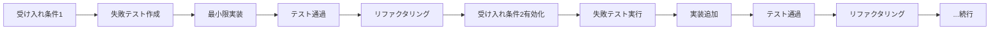
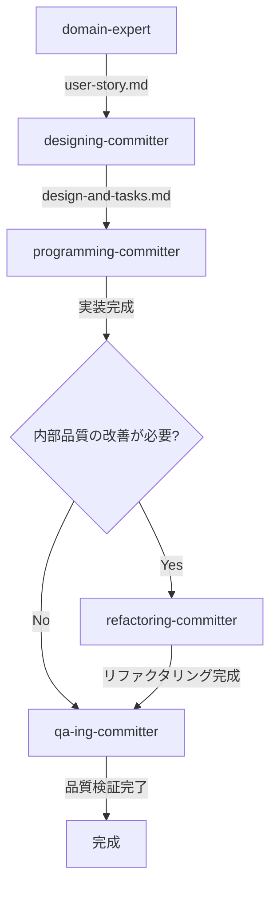

# 履修管理システム - 現在の実装状況と次期開発ガイド

## 概要

このドキュメントは、Effect-TSを用いたCQRS/イベントソーシング履修管理システムの現在の実装状況を正確に反映し、今後の開発方針を示します。

## 現在の実装状況（詳細）

### ✅ 完全実装済み

#### 1. ドメイン層の基盤

**値オブジェクト** (`src/contexts/enrollment/domain/models/shared/value-objects.ts`)
```typescript
// Effect Schemaによる実行時バリデーション付き
export type StudentId = string & Brand.Brand<"StudentId">;         // S12345678形式
export type CourseId = string & Brand.Brand<"CourseId">;           // C123456形式
export type Term = string & Brand.Brand<"Term">;                   // YYYY-Season形式
export type RegistrationSessionId = string & Brand.Brand<"RegistrationSessionId">; // 複合キー
export type EnrollmentId = string & Brand.Brand<"EnrollmentId">;   // 複合キー
export type Grade = "A" | "B" | "C" | "D" | "F" | "W" | "I" | "P";
```

**履修登録セッション集約** (`src/contexts/enrollment/domain/models/registration-session/registration-session.ts`)
```typescript
// 代数データ型による状態管理
export type RegistrationSessionStatus = Draft | Submitted | Approved | Rejected;

export class RegistrationSession extends Data.Class<{
  readonly id: RegistrationSessionId;
  readonly studentId: StudentId;
  readonly term: Term;
  readonly enrollments: ReadonlyArray<EnrollmentEntry>;
  readonly status: RegistrationSessionStatus;
  readonly totalUnits: number;
  readonly version: number;
}> {
  // ビジネスメソッド（実装済み）
  hasCourse(courseId: CourseId): boolean
  findDuplicateCourses(courseIds: ReadonlyArray<CourseId>): ReadonlyArray<CourseId>
  canModifyCourses(): boolean
  canSubmit(): boolean
  canApproveOrReject(): boolean
}

// ビジネス定数
export const MAX_UNITS_PER_TERM = 20;
export const MIN_UNITS_PER_TERM = 12;
```

**履修エンティティ** (`src/contexts/enrollment/domain/models/enrollment/enrollment.ts`)
```typescript
export type EnrollmentStatus =
  | "Requested" | "Approved" | "InProgress"
  | "Completed" | "Cancelled" | "Withdrawn";

export class Enrollment extends Data.Class<{
  // 完全な状態遷移ロジック実装済み
  canApprove(): boolean
  canStart(): boolean
  canComplete(): boolean
  canWithdraw(): boolean
}>;
```

#### 2. イベント・エラー定義

**ドメインイベント** (`src/contexts/enrollment/domain/events/registration-session-events.ts`)
```typescript
// 実装済みイベント
export class RegistrationSessionCreated extends Data.TaggedClass("RegistrationSessionCreated")<{
  readonly sessionId: RegistrationSessionId;
  readonly studentId: StudentId;
  readonly term: Term;
  readonly createdAt: Date;
}> {}

export class CoursesAddedToSession extends Data.TaggedClass("CoursesAddedToSession")<{
  readonly sessionId: RegistrationSessionId;
  readonly addedCourses: ReadonlyArray<CourseInfo>;
  readonly enrollmentRequests: ReadonlyArray<{
    readonly enrollmentId: EnrollmentId;
    readonly courseId: CourseId;
    readonly units: number;
  }>;
  readonly addedAt: Date;
}> {}

// 将来実装予定（コメントアウト状態）:
// - RegistrationSessionSubmitted
// - RegistrationSessionApproved
// - RegistrationSessionRejected
```

**ドメインエラー** (`src/contexts/enrollment/domain/errors/domain-errors.ts`)
```typescript
// 実装済みエラー体系
export class SessionAlreadyExists extends Data.TaggedError("SessionAlreadyExists")<{
  readonly sessionId: RegistrationSessionId;
}> {}

export class SessionNotFound extends Data.TaggedError("SessionNotFound")<{
  readonly sessionId: RegistrationSessionId;
}> {}

export class InvalidSessionState extends Data.TaggedError("InvalidSessionState")<{
  readonly sessionId: RegistrationSessionId;
  readonly currentState: string;
  readonly attemptedAction: string;
}> {}

export class MaxUnitsExceeded extends Data.TaggedError("MaxUnitsExceeded")<{
  readonly currentUnits: number;
  readonly requestedUnits: number;
  readonly maxUnits: number;
}> {}

export class DuplicateCourseInSession extends Data.TaggedError("DuplicateCourseInSession")<{
  readonly sessionId: RegistrationSessionId;
  readonly duplicateCourseIds: ReadonlyArray<string>;
}> {}
```

#### 3. アプリケーション層

**コマンド実装**

`src/contexts/enrollment/application/commands/create-registration-session.ts`
```typescript
// セッション作成コマンド（簡素化されたアプリケーション層）
export const createRegistrationSession = (command: CreateRegistrationSessionCommand) =>
  Effect.gen(function* () {
    // 1. セッションID生成（複合キー）
    const sessionId = yield* RegistrationSessionId.create(studentId, term);

    // 2. 重複チェック
    yield* ensureNotExists(sessionId);

    // 3. ドメインロジックでイベント作成
    const event = createRegistrationSessionEvent(sessionId, studentId, term);

    // 4. イベント保存・パブリッシュ（インフラ関連のみ）
    yield* eventStore.appendEvent(sessionId, "RegistrationSession", event);
    yield* eventBus.publish(event);

    return sessionId;
  });
```

`src/contexts/enrollment/application/commands/add-courses-to-session.ts`
```typescript
// 科目一括追加コマンド（簡素化されたアプリケーション層）
export const addCoursesToSession = (command: AddCoursesToSessionCommand) =>
  Effect.gen(function* () {
    // 1. セッション存在確認・取得
    const session = yield* repository.findById(sessionId);

    // 2. ドメインロジック実行（バリデーション・イベント生成）
    const coursesAddedEvent = yield* addCoursesToSessionDomain(session, courses);

    // 3. イベント保存・パブリッシュ（インフラ関連のみ）
    yield* eventStore.appendEvent(sessionId, "RegistrationSession", coursesAddedEvent);
    yield* eventBus.publish(coursesAddedEvent);

    return sessionId;
  });
```

#### 4. インフラ層（インメモリ実装）

**イベントストア** (`src/contexts/shared/infrastructure/event-store/in-memory-event-store.ts`)
```typescript
// 完全なイベントソーシング実装
export const InMemoryEventStore = Layer.succeed(EventStore, {
  appendEvent: (aggregateId, aggregateType, event) => // 実装済み
  getEvents: (aggregateId, aggregateType) =>          // 実装済み
  getAllAggregateIds: (aggregateType) =>              // 実装済み
});
```

**リポジトリ** (`src/contexts/enrollment/infrastructure/persistence/in-memory-registration-session-repository.ts`)
```typescript
// イベントからの集約再構築
export const InMemoryRegistrationSessionRepository = Layer.effect(
  RegistrationSessionRepository,
  Effect.gen(function* () {
    return {
      findById: (sessionId) =>
        // イベントストアからイベント取得 → 集約再構築
        // 完全なイベントソーシングパターン実装
    };
  })
);
```

#### 5. テスト実装

**ストーリーベース受け入れテスト** (`tests/stories/registration-session-start.acceptance.test.ts`)
```typescript
// 包括的な受け入れテスト（6テスト）
describe("Story 1: 履修登録セッション開始", () => {
  it("学生IDと学期を指定してセッションを作成できる")
  it("同じ学生・学期の重複セッション作成は失敗する")
  it("異なる学生または学期であれば複数セッションを作成できる")
  it("作成されたセッションはDraft状態である")
  it("不正な学生IDでコマンド実行は失敗する")
  it("不正な学期でコマンド実行は失敗する")
});
```

**カスタムアサーション** (`tests/helpers/assertions.ts`)
```typescript
// 再利用可能なテストヘルパー
export const assertSessionCreatedSuccessfully = ({ sessionId, expectedStudentId, expectedTerm, capturedEvents }) => // 実装済み
export const assertDuplicateSessionError = (error, expectedSessionId) => // 実装済み
export const assertMultipleSessionsCreated = (sessions, capturedEvents) => // 実装済み
// その他多数のアサーション実装済み
```

#### 6. 動作デモ

**メインプログラム** (`src/main.ts`)
```typescript
// CQRS/イベントソーシングの完全な動作確認
const program = Effect.gen(function* () {
  // 1. セッション作成
  const sessionId = yield* createRegistrationSession({ studentId, term });

  // 2. イベントキャプチャ確認
  const events = yield* Ref.get(capturedEvents);

  // 3. リポジトリからの復元確認
  const restoredSession = yield* repository.findById(sessionId);

  // コンソール出力で動作確認
});
```

#### 7. ドメインロジック関数

**ドメインロジック配置** (`src/contexts/enrollment/domain/models/registration-session/registration-session.ts`)
```typescript
// ドメインイベント生成関数
export const createRegistrationSession = (
  sessionId: RegistrationSessionId,
  studentId: StudentId,
  term: Term
): RegistrationSessionCreated => {
  return new RegistrationSessionCreated({
    sessionId,
    studentId,
    term,
    createdAt: new Date()
  });
};

// 科目追加のドメインロジック（バリデーション + イベント生成）
export const addCoursesToSession = (
  session: RegistrationSession,
  courses: ReadonlyArray<CourseInfo>
): Effect.Effect<
  CoursesAddedToSession,
  InvalidSessionState | DuplicateCourseInSession | MaxUnitsExceeded
> => Effect.gen(function* () {
  // シンプルな順次バリデーション
  yield* validateDraftState(session);
  yield* validateNoDuplicates(session, courses);
  yield* validateUnitLimit(session, courses);

  // 履修要求情報生成
  const enrollmentRequests = courses.map(course => {
    const enrollmentId = EnrollmentId.create(session.studentId, course.courseId, session.term);
    return {
      enrollmentId,
      courseId: course.courseId,
      units: course.units
    };
  });

  // イベント生成
  return new CoursesAddedToSession({
    sessionId: session.id,
    addedCourses: courses,
    enrollmentRequests,
    addedAt: new Date()
  });
});
```

**ドメインバリデーション関数** (`src/contexts/enrollment/domain/models/registration-session/registration-session.ts`)
```typescript
// 再利用可能なバリデーション関数群
export const validateDraftState = (session: RegistrationSession) =>
  session.canModifyCourses()
    ? Effect.void
    : Effect.fail(new InvalidSessionState({ ... }));

export const validateNoDuplicates = (session: RegistrationSession, courses: ReadonlyArray<CourseInfo>) => {
  const duplicates = session.findDuplicateCourses(courses.map(c => c.courseId));
  return duplicates.length === 0
    ? Effect.void
    : Effect.fail(new DuplicateCourseInSession({ ... }));
};

export const validateUnitLimit = (session: RegistrationSession, courses: ReadonlyArray<CourseInfo>) => {
  const newTotal = session.totalUnits + courses.reduce((sum, c) => sum + c.units, 0);
  return newTotal <= MAX_UNITS_PER_TERM
    ? Effect.void
    : Effect.fail(new MaxUnitsExceeded({ ... }));
};
```

### ❌ 未実装（CLAUDE.mdで詳細設計済み）

#### 1. 科目管理機能群
- ✅ 科目一括追加（完了）
- 科目削除・置換
- ✅ 単位数チェック・重複チェック（完了）
- ✅ 履修エントリ管理（完了）

#### 2. 履修ライフサイクル
- セッション提出・承認・却下
- 履修開始・完了・離脱
- 成績付与

#### 3. 高度なイベント群
```typescript
// 実装済み
✅ CoursesAddedToSession

// CLAUDE.mdで設計済み（未実装）
CoursesRemovedFromSession
SessionCoursesReplaced
RegistrationSessionSubmitted
RegistrationSessionApproved
RegistrationSessionRejected
EnrollmentsCancelledBatch
EnrollmentsApprovedBatch
EnrollmentStarted
EnrollmentCompleted
EnrollmentWithdrawn
```

#### 4. 本格的インフラ
- PostgreSQLイベントストア
- 投影（Projection）実装
- 複数Read Model
- REST API層

## アーキテクチャ評価

### 🟢 優秀な点

1. **型安全性**: Effect-TSとBrand型による実行時エラーの防止
2. **関数型設計**: イミュータブル・純粋関数による保守性
3. **イベントソーシング**: 完全な状態変更履歴の保持
4. **テスト品質**: 91.87%カバレッジ + ストーリーベース受け入れテスト
5. **エラーハンドリング**: Effect-TSによる型安全なエラー伝播
6. **責務分離**: ドメインロジックが適切にドメイン層に配置

### 🟡 改善可能な点

1. **機能完成度**: 基本的なセッション作成のみ（5-10%程度）
2. **ドメインロジック**: 複雑なビジネスルール未実装
3. **永続化**: インメモリのみ（本番利用不可）
4. **スケーラビリティ**: 単一プロセス前提

### 🔴 ギャップ分析

**現在のコードベース** vs **CLAUDE.md設計書**:
- 実装済み: 約 **15-20%**
- 設計済み: 約 **80-85%**
- 完全なプロダクションシステムまでの開発工数: **8-15倍**

## 次期開発ロードマップ

### ✅ Phase 1: ストーリー2実装（完了）
**目標**: 科目一括追加機能完成 ✅

**実装成果**:
```TypeScript
// 完成済み実装（リファクタリング後）
// ドメイン層
export const addCoursesToSession = (
  session: RegistrationSession,
  courses: ReadonlyArray<CourseInfo>
): Effect.Effect<CoursesAddedToSession, DomainErrors> =>
  Effect.gen(function* () {
    // シンプルな順次バリデーション
    yield* validateDraftState(session);
    yield* validateNoDuplicates(session, courses);
    yield* validateUnitLimit(session, courses);

    // ドメインイベント生成
    return new CoursesAddedToSession({ ... });
  });

// アプリケーション層（簡素化）
export const addCoursesToSession = (command) =>
  Effect.gen(function* () {
    const session = yield* repository.findById(sessionId);
    const event = yield* addCoursesToSessionDomain(session, courses);

    yield* eventStore.appendEvent(sessionId, "RegistrationSession", event);
    yield* eventBus.publish(event);
    return sessionId;
  });
```

**完了済みタスク**:
- ✅ 受け入れテスト完全実装（`tests/stories/course-addition.acceptance.test.ts`）
- ✅ ドメインイベント統合実装（`CoursesAddedToSession`）
- ✅ ドメインロジックのドメイン層への適切な配置
- ✅ アプリケーションコマンド（`AddCoursesToSessionCommand`）
- ✅ カスタムアサーション拡張完了
- ✅ リファクタリング: バリデーションビルダー削除とシンプル化

**達成成果**:
- ✅ 全テスト通過維持
- ✅ カバレッジ維持: 90%以上
- ✅ 完成度: 5% → 15-20%
- ✅ アーキテクチャ品質向上（関数型パターン導入）

### 🎯 Phase 2: ストーリー3実装（短期 1-2週間）
**目標**: 履修登録提出機能完成

**実装対象**（リファクタリング後のパターン準拠）:
```TypeScript
// ドメイン層
export const submitRegistrationSession = (
  session: RegistrationSession
): Effect.Effect<RegistrationSessionSubmitted, InvalidSessionState | MinUnitsNotMet> =>
  Effect.gen(function* () {
    // シンプルな順次バリデーション
    yield* validateDraftState(session);
    yield* validateMinimumUnits(session);

    // ドメインイベント生成
    return new RegistrationSessionSubmitted({
      sessionId: session.id,
      submittedAt: new Date()
    });
  });

// アプリケーション層
export const submitRegistrationSession = (command: SubmitRegistrationSessionCommand) =>
  Effect.gen(function* () {
    const session = yield* repository.findById(sessionId);
    const event = yield* submitRegistrationSessionDomain(session);

    yield* eventStore.appendEvent(sessionId, "RegistrationSession", event);
    yield* eventBus.publish(event);
    return sessionId;
  });
```

**実装タスク**:
1. 受け入れテスト作成（`tests/stories/session-submission.acceptance.test.ts`）
2. ドメインイベント実装（`RegistrationSessionSubmitted`）
3. ドメインエラー実装（`MinUnitsNotMet`）
4. ドメインバリデーション（`validateMinimumUnits`）
5. アプリケーションコマンド（`SubmitRegistrationSessionCommand`）
6. カスタムアサーション拡張

**期待成果**:
- テスト数: 現在 → +5-8テスト
- カバレッジ維持: 90%以上
- 完成度: 15-20% → 25-30%

### Phase 3: 履修ライフサイクル完成（中期 4-6週間）
**目標**: 承認→履修開始の完全フロー

1. **ストーリー4**: アドバイザー承認
   - 承認・却下機能
   - 状態遷移（Submitted → Approved/Rejected）

2. **ストーリー5**: 履修開始
   - 学期開始処理
   - 状態遷移（Approved → InProgress）

**期待成果**:
- 基本的なワークフロー完成
- 完成度: 25-30% → 50%

### Phase 4: 本格インフラ（長期 8-12週間）
**目標**: プロダクション対応基盤

1. **PostgreSQL移行**: イベントストア永続化
2. **投影実装**: CQRS Read Model構築
3. **REST API**: Express/Fastify統合
4. **成績管理**: 履修完了・成績付与

**期待成果**:
- 完成度: 50% → 80%
- プロダクション利用可能レベル

## 開発者向けガイド

### 開発環境セットアップ
```bash
npm install
npm run test        # 全テスト実行
npm run test:coverage # カバレッジ確認
npm run dev         # デモプログラム実行
npm run typecheck   # TypeScript型チェック
```

### AcceptanceTDD開発手法（必須）

#### 基本原則
履修管理システムの開発では、**AcceptanceTDD（受け入れテスト駆動開発）**を必須開発手法として採用します。

1. **段階的受け入れ条件実装**: 1つずつ受け入れ条件を完了させる
2. **TDDサイクル遵守**: Red→Green→Refactorを各条件で実行
3. **最小限実装**: 各段階で過剰実装を避ける
4. **継続的設計改善**: 各フェーズで設計品質を向上

#### 実装フロー（標準パターン）



#### 段階的実装戦略

**Phase 1: 基本正常系（最重要）**
- 最もビジネス価値の高い受け入れ条件を1つ選定
- 失敗するテストを作成（Red状態）
- 最小限の実装でテスト通過（Green状態）
- 設計品質改善（Refactor）

**Phase 2: 主要異常系（段階的拡張）**
- 重要なエラーケースを1つずつ実装
- 各条件でRed→Green→Refactorサイクル実行
- エラーハンドリングの段階的構築

**Phase 3: 境界値・エッジケース（完成）**
- 境界値テストの段階的実装
- エッジケースの包括的カバー
- 最終的な品質確保

#### Acceptance Testファイル標準構成

```typescript
describe("Story X: [機能名]", () => {
  // Phase 1: 基本正常系（最初はこれのみ有効）
  it("AC1: [最重要な正常系受け入れ条件]", () => {
    return Effect.gen(function* () {
      // Arrange: テストデータ準備
      // Act: 機能実行
      // Assert: 結果検証（カスタムアサーション使用）
    }).pipe(Effect.provide(TestLayer), Effect.runPromise);
  });

  // Phase 2以降: 最初は全てskip状態で実装
  it.skip("AC2: [重要異常系1]", () => {
    return Effect.gen(function* () {
      // エラーケースの実装
      const error = yield* command.pipe(Effect.flip);
      assertSpecificError(error, expectedParams);
    }).pipe(Effect.provide(TestLayer), Effect.runPromise);
  });

  it.skip("AC3: [重要異常系2]", () => { ... });
  it.skip("AC4: [境界値1]", () => { ... });
  it.skip("AC5: [境界値2]", () => { ... });
  it.skip("エッジケース1: [特殊ケース1]", () => { ... });
});
```

#### 実装進行管理
- **段階的テスト有効化**: `it.skip()` を `it()` に1つずつ変更
- **コミット戦略**: 各フェーズ完了時に独立したコミット
- **進捗確認**: 有効化されたテスト数での進捗把握

### コード規約
1. **Effect-TS優先**: Promiseではなく常にEffectを使用
2. **Brand型活用**: プリミティブ値には必ずBrand型を適用
3. **不変性**: すべてのドメインオブジェクトはイミュータブル
4. **AcceptanceTDD必須**: 新機能は必ずAcceptanceTDDで段階的実装
5. **型安全**: `any`型の使用禁止、完全な型注釈

### AcceptanceTDD品質基準（必須）
1. **段階的実装**: 受け入れ条件を1つずつ完了（一括実装禁止）
2. **TDDサイクル**: 各受け入れ条件でRed→Green→Refactorサイクル実行
3. **最小限実装**: 各フェーズで過剰実装回避、必要最小限の実装
4. **継続的リファクタリング**: 各フェーズ完了時の設計品質向上
5. **テスト進行管理**: `it.skip()` から `it()` への段階的変更記録
6. **フェーズ別コミット**: Phase毎の独立したコミットによる進捗管理

### テスト規約（プロトタイプフェーズ）
1. **AcceptanceTDD優先**: 段階的受け入れテスト実装最優先
2. **カスタムアサーション**: 複雑な検証ロジックは再利用可能な関数化
3. **統合テスト保留**: プロトタイプフェーズでは受け入れテストで代替
4. **90%+カバレッジ**: 品質基準の維持必須
5. **ROI重視**: 投資対効果を考慮したテスト実装判断

### アーキテクチャパターン

#### ドメイン層
```typescript
// ❌ 悪い例: プリミティブ値使用
function createSession(studentId: string, term: string) { ... }

// ✅ 良い例: Brand型使用
function createSession(studentId: StudentId, term: Term) { ... }

// ❌ 悪い例: ドメインロジックがアプリケーション層に漏れる
// application layer
const event = new RegistrationSessionCreated({ ... });

// ✅ 良い例: ドメインロジックはドメイン層に
// domain layer
export const createRegistrationSession = (...) => new RegistrationSessionCreated({ ... });
// application layer
const event = createRegistrationSession(...);
```

#### アプリケーション層
```typescript
// ❌ 悪い例: 例外投げる
if (!session) throw new Error("Session not found");

// ✅ 良い例: Effect型でエラーハンドリング
const session = yield* repository.findById(sessionId).pipe(
  Effect.flatMap(Option.match({
    onNone: () => Effect.fail(new SessionNotFound({ sessionId })),
    onSome: Effect.succeed
  }))
);
```

#### テスト
```typescript
// ❌ 悪い例: 実装詳細のテスト
it("内部バリデーション関数を呼び出す", () => {
  // 内部実装に依存するテスト
});

// ✅ 良い例: ビジネス価値のテスト
it("AC1: 12単位以上のセッションを提出できる", async () => {
  const sessionId = yield* setupTestSession(studentId, term, [4, 4, 4]);
  yield* submitRegistrationSession({ sessionId, submittedBy: studentId });
  yield* assertSessionSubmittedSuccessfully({ sessionId, capturedEvents });
});

// ✅ 良い例: カスタムアサーション使用
yield* assertSessionCreatedSuccessfully({
  sessionId, expectedStudentId, expectedTerm, capturedEvents
});

// ✅ 良い例: Effect.flipによる失敗テスト
const error = yield* createRegistrationSession({ studentId, term }).pipe(
  Effect.flip
);
// エラーをSuccessとして扱い、その後アサーション
assertDuplicateSessionError(error, expectedSessionId);
```

## まとめ

このプロジェクトは **高品質な基盤実装** を持つ優秀なプロトタイプです。Effect-TSによる関数型CQRS/イベントソーシングパターンの実装例として価値があり、今後の段階的な機能拡張により本格的な履修管理システムに発展可能です。

**現在の価値**:
- ✅ アーキテクチャパターンの学習・参考実装
- ✅ Effect-TSエコシステムのベストプラクティス
- ✅ CQRS/イベントソーシングの実践例
- ✅ 型安全な関数型DDD実装

**今後の発展性**:
- 🎯 エンタープライズレベルの履修管理システム
- 🎯 マイクロサービスアーキテクチャの基盤
- 🎯 Effect-TSによる大規模システム開発の参考実装

適切な開発リソースが投入されれば、**6-12ヶ月でプロダクション対応**の履修管理システム構築が可能な優秀な基盤です。

## Claude Code エージェントシステム活用ガイド

### エージェント導入の背景

本プロジェクトの開発効率を最大化するため、Claude Codeの特化型エージェントシステムを導入しています。各エージェントは特定の開発フェーズに特化し、一貫した品質とパターンを保ちながら開発を加速します。

### エージェント一覧と責任範囲

#### 🎯 programming-committer（タスク完成特化型開発者）
**専門領域**: 計画されたタスクの確実な実装完了
- **主要責任**: 失敗するテストから始まる実装、最小限のコード作成
- **適用場面**: ストーリー実装、バグ修正、機能追加
- **品質基準**: 全テスト通過、TypeScriptエラー0、既存機能の非破壊
- **使用例**: `programming-committer "ストーリー3：履修登録提出機能を実装"`

#### 👨‍💼 domain-expert（履修管理ドメインエキスパート）
**専門領域**: 履修管理業務の要件整理とストーリー設計
- **主要責任**: ユーザーストーリー作成、受け入れ条件定義、ビジネスルール文書化
- **適用場面**: 新機能の要件定義、ストーリー優先順位付け、エッジケース洗い出し
- **成果物**: ユーザーストーリー、受け入れ条件、ビジネスルール仕様
- **使用例**: `domain-expert "科目削除・置換機能のストーリーを作成"`

#### 🏗️ designing-committer（CQRS設計特化型開発者）
**専門領域**: CQRS/イベントソーシングの技術設計
- **主要責任**: ストーリーの技術タスク分解、ドメインイベント設計、アーキテクチャパターン適用
- **適用場面**: 新機能の技術設計、複雑な業務フローの分析、実装前の設計検証、エンジニアタスクに分解
- **成果物**: タスク分解リスト、ドメインイベント仕様、技術設計書
- **使用例**: `designing-committer "履修開始機能のCQRS設計"`

#### 🔧 refactoring-committer（リファクタリング専門開発者）
**専門領域**: コード品質向上と技術的負債解消
- **主要責任**: 既存コードの改善、保守性向上、パフォーマンス最適化
- **適用場面**: 技術的負債の解消、コード統合、パフォーマンス改善
- **品質基準**: 機能の非破壊、テスト通過維持、可読性向上
- **使用例**: `refactoring-committer "バリデーション関数の共通化"`

#### 🧪 qa-ing-committer（品質保証特化型開発者）
**専門領域**: テスト戦略立案と品質検証
- **主要責任**: テスト網羅性確保、エッジケース特定、品質基準検証
- **適用場面**: テストケース拡充、品質監査、受け入れテスト設計
- **成果物**: テスト戦略、品質レポート、追加テストケース
- **使用例**: `qa-ing-committer "ストーリー3のテスト網羅性を検証"`

#### 🔄 retrospecting-committer（振り返り特化型開発者）
**専門領域**: プロジェクトの自律的改善推進と継続的品質向上
- **主要責任**: 成果物分析、Git履歴・チャットログ学習、エージェント設定最適化、CLAUDE.md進化
- **適用場面**: ストーリー完了後振り返り、定期的全体レビュー、エージェント連携改善、プロセス最適化
- **成果物**: 振り返りレポート、エージェント改善提案、CLAUDE.md更新、ワークフロー改善案
- **使用例**: `retrospecting-committer "ストーリー3完了の振り返りと改善提案"`

### 開発フェーズ別エージェント活用戦略

#### Phase 1: 要件定義・ストーリー作成
```bash
# ドメインエキスパートによる要件整理
domain-expert "新機能 [機能名] のユーザーストーリーと受け入れ条件を作成"
```
**成果物**: ユーザーストーリー、受け入れ条件、ビジネスルール

#### Phase 2: 技術設計・タスク分解
```bash
# 設計エージェントによる技術設計
designing-committer "ストーリー [番号] の技術設計とタスク分解"
```
**成果物**: 技術設計書、実装タスクリスト、ドメインイベント仕様

#### Phase 3: 実装・テスト
```bash
# タスク完成エージェントによる実装
programming-committer "タスク [詳細] を実装"
```
**成果物**: 動作するコード、通過するテスト、実装ドキュメント

#### Phase 4: 品質向上・リファクタリング
```bash
# 品質向上エージェントによる改善
refactoring-committer "コードベース [対象] の品質改善"
```
**成果物**: 改善されたコード、技術的負債の解消

#### Phase 5: 品質保証・テスト強化
```bash
# QAエージェントによる品質検証
qa-ing-committer "機能 [対象] の品質検証とテスト強化"
```
**成果物**: 品質レポート、追加テストケース、品質改善提案

### プロジェクト固有の活用パターン

#### ストーリー実装の標準フロー
1. **要件明確化**: `domain-expert` で受け入れ条件を精緻化
2. **技術設計**: `designing-committer` でCQRS設計・タスク分解
3. **実装**: `programming-committer` で確実なタスク完成
4. **内部品質向上**: `refactoring-committer` で必要に応じてリファクタリング
5. **品質検証**: `qa-ing-committer` でテスト品質確保

#### 複雑な機能開発時
```bash
# 段階的なエージェント連携
domain-expert "履修完了・成績付与機能の要件整理してください"
qa-ing-committer "受け入れテストパターンを見直してください"
designing-committer "履修完了・成績付与機能の実現するための設計とタスク分解してください"
refactoring-committer "履修完了・成績付与機能を実装しやすくするためのリファクタリング案を提案してください"
programming-committer "計画に基づき履修完了・成績付与機能の実装を行ってください"
refactoring-committer "履修完了・成績付与機能のコードをリファクタリングしてください"
qa-ing-committer "履修完了・成績付与機能の品質検証を行ってください"
retrospecting-committer "機能開発サイクルの振り返りと改善提案を行ってください"
```

### エージェント設定のカスタマイズ

#### プロジェクト固有の制約・パターン
- **Effect-TSパターンの強制**: Brand型、Schema、Layer型の使用
- **テストファースト開発**: 受け入れテストからの実装開始
- **カバレッジ維持**: 90%以上のカバレッジ維持
- **型安全性**: `any`型使用禁止、完全な型注釈

#### 品質基準の統一
- 全テスト通過（65テスト以上）
- TypeScriptエラー0
- 既存機能の非破壊
- コード規約の遵守

### エージェント活用のベストプラクティス

#### 1. 適切なエージェント選択
- **要件不明時**: `domain-expert` で要件明確化
- **設計段階**: `designing-committer` で技術設計
- **実装段階**: `programming-committer` で確実な完成
- **品質課題**: `refactoring-committer` や `qa-ing-committer` で改善

#### 2. エージェント間の連携
- 前のエージェントの成果物を次のエージェントに引き継ぎ
- 一貫した品質基準の維持
- プロジェクト固有パターンの継承

#### 3. 段階的な品質向上
- 最小限実装 → 品質改善 → 最終検証の段階的アプローチ
- 各段階での品質チェックポイント設定
- 継続的な品質向上サイクル

### 今後の拡張予定

#### 新エージェントの追加検討
- **api-committer**: REST API実装特化型
- **db-committer**: PostgreSQL移行特化型
- **ui-committer**: フロントエンド実装特化型

#### エージェント設定の継続改善
- **retrospecting-committer主導**: データドリブンな設定最適化
- プロジェクト進行に応じた設定の調整
- 新たなパターン・制約の追加
- 品質基準の段階的向上
- 成功・失敗パターンの学習と反映

このエージェントシステムにより、**一貫した品質** と **効率的な開発** を両立し、プロダクション対応の履修管理システムを構築します。

## エージェント連携フローと成果物管理

### エージェント間のファイル連携体系

#### 1. 成果物の保存場所
すべてのエージェント成果物は `.claude/tmp/` ディレクトリにストーリー単位でグループ化して保存：

```
.claude/tmp/
└── {story-name}/                        # ストーリー単位のディレクトリ
    ├── user-story.md                    # domain-expert 出力
    ├── design-and-tasks.md              # designing-committer 出力
    ├── qa-report.md                     # qa-ing-committer 出力
    └── test-improvements.md             # qa-ing-committer 出力
```

#### 2. エージェント連携フロー詳細



#### 3. エージェント別参照ファイル

##### domain-expert 参照
- **技術制約**: `CLAUDE.md`

##### designing-committer 参照
- **技術制約**: `CLAUDE.md`
- **業務要件**: `.claude/tmp/{story-name}/user-story.md` （domain-expert出力）

##### programming-committer 参照
- **技術制約**: `CLAUDE.md`
- **業務要件**: `.claude/tmp/{story-name}/user-story.md`
- **技術設計と分解したタスク**: `.claude/tmp/{story-name}/design-and-tasks.md`

##### refactoring-committer 参照
- **技術制約**: `CLAUDE.md`
- **業務要件**: `.claude/tmp/{story-name}/user-story.md` （domain-expertの出力）
- **技術設計と分解したタスク**: `.claude/tmp/{story-name}/design-and-tasks.md` （designing-committerの出力）
- **既存コード**: 実装済みコードベース

##### qa-ing-committer 参照
- **技術制約**: `CLAUDE.md`
- **業務要件**: `.claude/tmp/{story-name}/user-story.md` （受け入れ条件確認）
- **技術設計と分解したタスク**: `.claude/tmp/{story-name}/design-and-tasks.md`
- **既存テスト**: `tests/` ディレクトリ
- **実装結果**: 完成したコードベース

##### retrospecting-committer 参照
- **技術制約**: `CLAUDE.md`
- **全エージェント成果物**: `.claude/tmp/` ディレクトリ全体
- **Git作業履歴**: `git log`, `git diff main...HEAD`
- **プロジェクト状況**: `README.md`, テスト結果, カバレッジ情報
- **既存エージェント設定**: `.claude/agents/` ディレクトリ全体

### 標準作業フロー

#### ストーリー実装の完全フロー
```bash
# 1. 要件定義フェーズ
domain-expert "ストーリー3: 履修登録提出機能のユーザーストーリーを作成"
# 出力: .claude/tmp/story3-submission/user-story.md

# 2. 技術設計フェーズ
designing-committer "ストーリー3の技術設計とタスク分解を行って"
# 出力: .claude/tmp/story3-submission/design-and-tasks.md

# 3. 実装フェーズ
programming-committer "ストーリー3: 履修登録提出機能を実装してください"
# 成果: 動作するコード、通過するテスト

# 4. 品質向上フェーズ（必要に応じて）
refactoring-committer "ストーリー3の実装コードの品質向上のためのリファクタリング案を提案して"

# 5. 品質検証フェーズ
qa-ing-committer "ストーリー3の品質検証とテスト強化"
# 出力: .claude/tmp/story3-submission/qa-report.md
#       .claude/tmp/story3-submission/test-improvements.md

# 6. 振り返りフェーズ
retrospecting-committer "ストーリー3完了の振り返りと改善提案"
# 出力: .claude/tmp/reflections/{timestamp}/reflection-report.md
#       エージェント設定・CLAUDE.mdの改善更新
```

#### 複雑な機能の段階的開発
```bash
# Phase 1: 要件詳細化
domain-expert "履修完了・成績付与機能の詳細要件を整理"
qa-ing-committer "受け入れテストパターンの事前検討"

# Phase 2: 設計分割
designing-committer "履修完了・成績付与機能を段階的に実装可能な設計に分割"

# Phase 3: 段階的実装
programming-committer "第1フェーズ: 履修完了処理を実装"
qa-ing-committer "第1フェーズの品質検証"
programming-committer "第2フェーズ: 成績付与処理を実装"
qa-ing-committer "第2フェーズの品質検証"

# Phase 4: 統合・最終化
refactoring-committer "全体の統合とコード品質最終調整"
qa-ing-committer "機能全体の最終品質検証"
retrospecting-committer "複雑機能開発の全体振り返りと改善提案"
```

### 品質保証の連携ポイント

#### 各エージェントの品質責任
- **domain-expert**: 業務要件の完全性・整合性
- **designing-committer**: 技術設計の健全性・実装可能性
- **programming-committer**: コード品質・テスト通過・機能完成
- **refactoring-committer**: 内部品質・保守性・技術的負債解消
- **qa-ing-committer**: 総合品質・テスト網羅性・品質基準適合
- **retrospecting-committer**: 継続的改善・エージェント最適化・プロセス品質

#### 品質チェックポイント
1. **要件定義後**: domain-expert ↔ qa-ing-committer の相互確認
2. **技術設計後**: designing-committer ↔ qa-ing-committer の設計レビュー
3. **実装完了後**: programming-committer → qa-ing-committer の品質検証
4. **リファクタリング後**: refactoring-committer → qa-ing-committer の最終確認
5. **ストーリー完了後**: retrospecting-committer による全体振り返りと改善

### トラブルシューティング

#### エージェント連携の問題と対処
- **品質基準齟齬**: CLAUDE.md の品質基準セクション参照
- **実装方針相違**: 技術設計書の再確認と designing-committer への相談
- **テスト不十分**: qa-ing-committer による追加テスト戦略の策定

この体系的なエージェント連携により、**一貫した品質** と **効率的な開発サイクル** を実現します。
