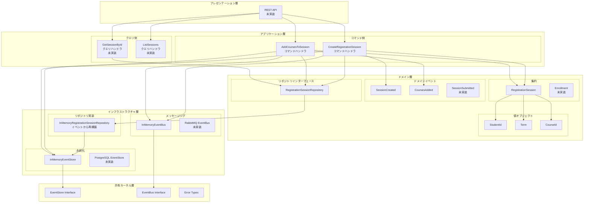
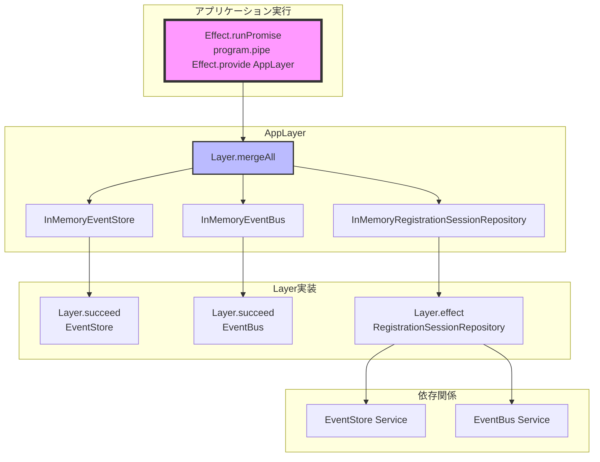
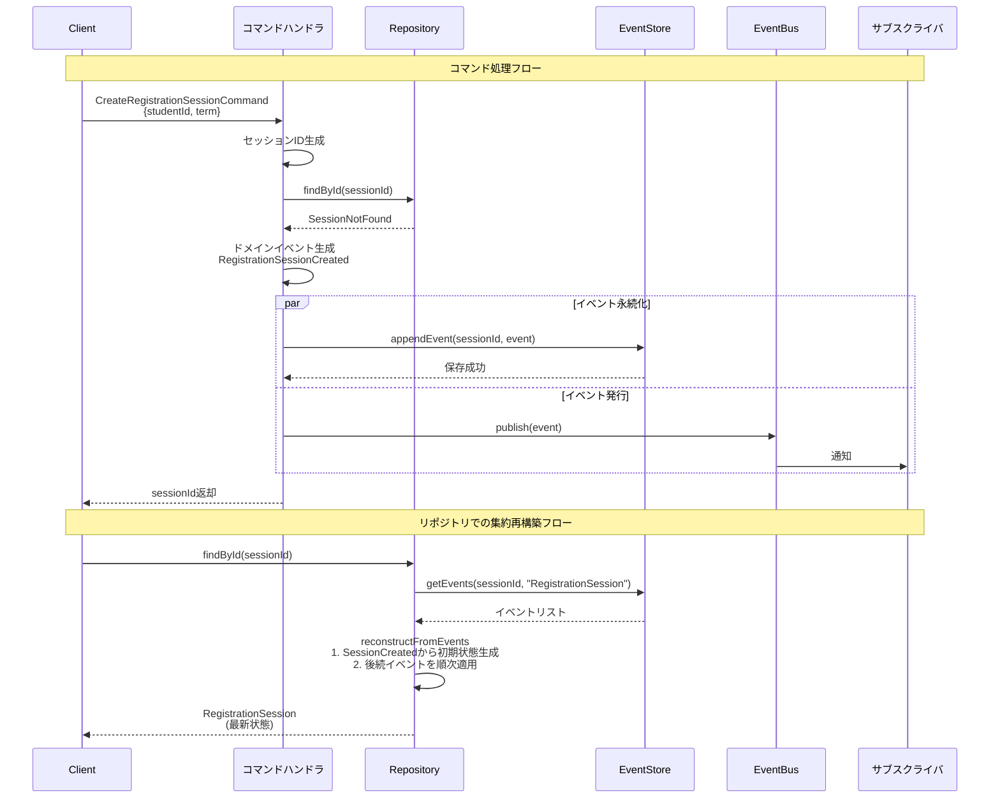
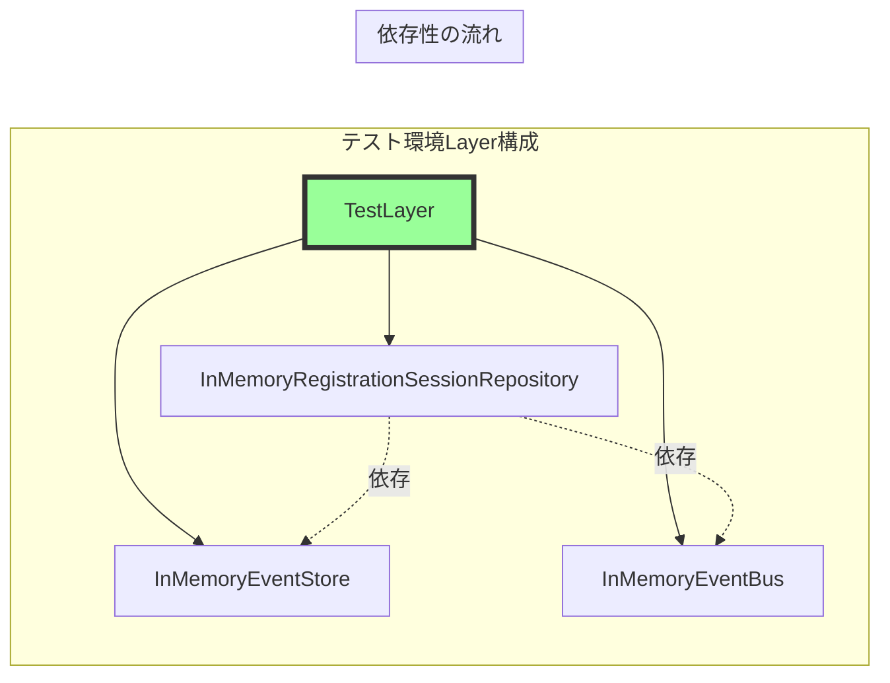

# 履修管理システム実装計画 - 受け入れテストファーストアプローチ

## 概要
受け入れテストから始めるストーリー単位の実装により、ユーザー価値を段階的に提供します。
各ストーリー完了時点で動作するソフトウェアが存在し、早期フィードバックが可能です。

**現在のステータス**: ストーリー1-2完了 ✅ → ストーリー3開始準備 🎯

## 実装方針
1. **受け入れテストファースト**: 失敗するテストから開始
2. **ストーリー単位**: バーティカルスライスで価値を提供
3. **最小限実装**: テストが通る最小限のコード
4. **段階的拡張**: 前ストーリー完了後に次へ進む
5. CQRS、ビジネスイベントの記録と、現状の状態参照は分離する

## ユーザーストーリー実装順序

### ✅ 完了済み
- [x] プロジェクト基盤構築（境界づけられたコンテキスト構成）
- [x] ドメイン層基本実装（集約、エンティティ、値オブジェクト）
- [x] ドメインモデルテスト（25テスト）
- [x] **ストーリー1: 履修登録セッション開始** - 包括的な受け入れテスト + カスタムアサーション実装

### ✅ ストーリー1: 履修登録セッション開始 (完了)
**AS A** 学生
**I WANT TO** 履修科目を選択するために履修登録セッションを開始する
**SO THAT** 履修登録プロセスを始められる

**実装タスク**:
- [x] 受け入れテスト: セッション作成の成功シナリオ
- [x] 受け入れテスト: 重複セッション作成の失敗シナリオ
- [x] 受け入れテスト: バリデーションエラーケース
- [x] 受け入れテスト: 複数セッション作成テスト
- [x] ドメインイベント: `RegistrationSessionCreated`
- [x] ドメインエラー: `SessionAlreadyExists`
- [x] アプリケーションコマンド: `CreateRegistrationSessionCommand`
- [x] インメモリEventStore実装
- [x] インメoryEventBus実装
- [x] インメモリRepository実装
- [x] カスタムテストアサーション実装
- [x] テスト通過確認（6テスト全パス）

**受け入れ条件**:
- [x] 学生IDと学期を指定してセッションを作成できる
- [x] 同じ学生・学期の重複セッション作成は失敗する
- [x] 作成されたセッションはDraft状態である
- [x] セッションIDが生成され、後の操作で使用できる
- [x] リポジトリからセッションを取得可能
- [x] イベントバスにイベントが正しく発行される
- [x] バリデーションエラーが適切にハンドリングされる

**実装成果**:
- 真の受け入れテスト: コマンド→ドメイン→イベントストア→イベントバス→リポジトリ→クエリ
- カスタムアサーション: 再利用可能で読みやすいテストヘルパー
- Effect-TSによる型安全な実装
- イベントソーシングパターンの完全実装
- **トータル: 65テスト, カバレッシ91.89%**

### ✅ ストーリー2: 科目一括追加 (完了)
**AS A** 学生
**I WANT TO** 選択した複数の科目を履修登録セッションに一括で追加する
**SO THAT** 効率的に履修科目を登録できる

**既存実装済み要素**:
- [x] ドメインモデル基盤 (`RegistrationSession` クラス)
- [x] 重複チェックロジック (`hasCourse`, `findDuplicateCourses`)
- [x] ビジネスルール定数 (`MAX_UNITS_PER_TERM = 20`)
- [x] 状態チェック (`canModifyCourses`)
- [x] 基盤インフラ (EventStore, EventBus, Repository)

**実装成果** (関数型アーキテクチャで高品質実装):
- [x] 受け入れテスト完全実装 (`tests/stories/course-addition.acceptance.test.ts`)
  - [x] 科目一括追加の成功シナリオ
  - [x] 単位数上限超過の失敗シナリオ
  - [x] 重複科目追加の失敗シナリオ
  - [x] セッション未存在での追加失敗シナリオ
  - [x] 不正状態(Draft以外)での追加失敗シナリオ
- [x] ドメインエラー完全実装 (`MaxUnitsExceeded`, `DuplicateCourseInSession`, `InvalidSessionState`)
- [x] ドメインイベント統合実装 (`CoursesAddedToSession`)
- [x] ドメインロジック関数実装 (`addCoursesToSession`, `createRegistrationSession`)
- [x] アプリケーションコマンド簡素化 (`AddCoursesToSessionCommand`)
- [x] カスタムアサーション拡張完了（科目追加用テストヘルパー）
- [x] 統合テストと動作確認完了

**アーキテクチャ成果**:
- **ドメインロジック集約**: イベント生成とバリデーションがドメイン層に適切配置
- **責務分離**: アプリケーション層はインフラ調整のみに責務限定
- **シンプル化**: 不要な抽象化（バリデーションビルダー）を削除
- **Effect-TSマスタリー**: 型安全な関数型アーキテクチャの完全実装

**受け入れ条件**:
- 複数科目を一度に追加できる
- 重複科目の追加は失敗する（既存ロジック活用）
- 単位数上限（20単位）を超える追加は失敗する
- 追加後のセッションに科目と単位数が反映される
- Draft状態でのみ科目追加が可能
- 適切なドメインイベントが発行される

**達成成果**:
- ✅ 受け入れテスト: 6 → 11 (+5テスト)
- ✅ カバレッジ維持: 90%以上
- ✅ 型安全性: TypeScriptエラー0
- ✅ ストーリー3（履修登録提出）への基盤構築完了

### 🎯 ストーリー3: 履修登録提出 (次のターゲット)
**AS A** 学生
**I WANT TO** 選択した科目を確定するために履修登録を提出する
**SO THAT** アドバイザーによる承認を受けられる

**実装タスク** (ストーリー2のパターンを活用して効率化):
- [ ] 受け入れテストファイル作成 (`tests/stories/session-submission.acceptance.test.ts`)
  - [ ] 履修登録提出の成功シナリオ
  - [ ] 最小単位数不足の失敗シナリオ
  - [ ] 不正状態での提出失敗シナリオ
- [ ] ドメインイベント実装: `RegistrationSessionSubmitted`
- [ ] ドメインエラー実装: `MinUnitsNotMet`
- [ ] 関数型バリデーション: `validateMinimumUnits`
- [ ] アプリケーションコマンド: `SubmitRegistrationSessionCommand`
- [ ] カスタムアサーション拡張
- [ ] 統合テストと動作確認

**実装方針**:
- **ストーリー2パターン流用**: ドメインロジック関数・イベント駆動アーキテクチャ
- **既存基盤活用**: EventStore, EventBus, Repositoryの再利用
- **関数型設計**: シンプルな順次バリデーションとEffect型の活用

**受け入れ条件**:
- Draft状態のセッションを提出できる
- 最小単位数（12単位）未満の場合は失敗する
- 提出後はSubmitted状態になる
- Draft以外の状態では提出できない

### 📝 ストーリー4: アドバイザー承認
**AS AN** アドバイザー
**I WANT TO** 提出された履修登録を確認して承認・却下する
**SO THAT** 学生の履修計画が適切であることを保証できる

**実装タスク**:
- [ ] 受け入れテスト: 履修登録承認の成功シナリオ
- [ ] 受け入れテスト: 履修登録却下の成功シナリオ
- [ ] 受け入れテスト: 承認待ち一覧取得
- [ ] ドメインイベント: `RegistrationSessionApproved/Rejected`, `EnrollmentsApprovedBatch`
- [ ] ドメインロジック: セッション承認/却下
- [ ] アプリケーションコマンド: `ApproveRegistrationSessionCommand`, `RejectRegistrationSessionCommand`
- [ ] アプリケーションクエリ: `GetPendingSessionsQuery`
- [ ] テスト通過確認

**受け入れ条件**:
- Submitted状態のセッションを承認できる
- 承認理由と承認者を記録する
- 承認後はApproved状態になり、関連履修もApproved状態になる
- 却下時は理由と却下者を記録する
- 承認待ちセッション一覧を取得できる

### 🚀 ストーリー5: 履修開始
**AS A** 学生
**I WANT TO** 承認された履修について学期開始時に履修を開始する
**SO THAT** 授業に参加して単位取得に向けて学習できる

**実装タスク**:
- [ ] 受け入れテスト: 履修開始の成功シナリオ
- [ ] 受け入れテスト: 一括履修開始（学期開始処理）
- [ ] ドメインイベント: `EnrollmentStarted`
- [ ] ドメインロジック: 履修開始
- [ ] アプリケーションコマンド: `StartEnrollmentCommand`, `StartTermEnrollmentsCommand`
- [ ] テスト通過確認

**受け入れ条件**:
- Approved状態の履修を開始できる
- 履修開始後はInProgress状態になる
- 学期開始時に該当する全履修を一括開始できる
- 開始日時が記録される

## 受け入れテスト戦略

### テストカテゴリ
- **😊 ハッピーパス**: 正常な業務フロー
- **😱 エラーケース**: 異常系・境界値
- **🔄 状態遷移**: 不正な状態変更の防止
- **🏢 ビジネスルール**: ドメイン制約の検証

### テスト環境
- インメモリ実装によるfast feedback
- 実際のAPIインターフェースでの統合テスト
- Given-When-Then形式による明確な仕様記述

### テストファイル構成
```
tests/
├── helpers/
│   └── assertions.ts                               # カスタムテストアサーション
└── stories/
    ├── registration-session-start.acceptance.test.ts     # ✅ ストーリー1 (完了)
    ├── course-addition.acceptance.test.ts                 # ✅ ストーリー2 (完了)
    ├── session-submission.acceptance.test.ts              # 🎯 ストーリー3 (次)
    ├── advisor-approval.acceptance.test.ts                # 📝 ストーリー4
    └── enrollment-start.acceptance.test.ts                # 🚀 ストーリー5
```

## 実装完了の定義
各ストーリーで以下が完了すること：
1. ✅ すべての受け入れテストがパス
2. 🏗️ 必要な実装が完了（Domain→Application→Infrastructure）
3. 📊 型チェックとLintエラーなし
4. 📖 テストが仕様書として機能
5. 🔄 前ストーリーとの統合動作確認

## 開発フロー
```
1. 受け入れテスト作成（失敗する）
2. 必要なインターフェースを特定
3. ドメイン層実装
4. アプリケーション層実装
5. インフラ層実装（インメモリ）
6. テスト通過確認
7. リファクタリング
8. 次ストーリーへ
```

## 次期実装候補（バックログ）
- 科目置換機能（ストーリー2の拡張）
- 履修完了・成績付与
- 履修離脱処理
- PostgreSQL永続化
- Read Model投影
- REST API実装
- ユーザーインターフェース

## 技術スタック
- **言語**: TypeScript
- **フレームワーク**: Effect-TS
- **アーキテクチャ**: DDD + CQRS + Event Sourcing
- **テスト**: Vitest (受け入れテスト, Unit)
- **データベース**: インメモリ → PostgreSQL
- **CI/CD**: GitHub Actions (予定)

## システムアーキテクチャ

### レイヤー構成とCQRSパターン



### Effect-TSによるLayer構成



### CQRSイベントフロー



### Layer依存関係の詳細



## Claude Code エージェント システム

本プロジェクトでは開発効率化のため、特化型エージェントシステムを活用しています。

### エージェントの役割と特徴

| エージェント | 役割 | 主な成果物 | 使用タイミング |
|------------|------|-----------|--------------|
| **domain-expert** | ビジネス要件の整理とユーザーストーリー作成 | user-story.md | 新機能開発の最初 |
| **designing-committer** | CQRS/ESに基づく技術設計とタスク分解 | design-and-tasks.md | ストーリー確定後 |
| **programming-committer** | TDD実装とテスト通過までの開発 | 実装コード + テスト | 設計完了後 |
| **refactoring-committer** | コード品質向上と技術的負債の解消 | リファクタリング提案 | 実装完了後 |
| **qa-ing-committer** | 品質検証とテスト戦略の策定 | qa-report.md | 各モード完了後 |
| **retrospecting-committer** | プロジェクト分析と継続的改善 | 改善提案 | マイルストーン達成時 |

### 基本的な使い方

```bash
# 1. 要件定義モード
domain-expert "ストーリー3: 履修登録提出機能のユーザーストーリーを作成して"
# 出力: .claude/tmp/story3-submission/user-story.md

# 2. 技術設計モード
designing-committer "ストーリー3の技術設計とタスク分解を行って"
# 出力: .claude/tmp/story3-submission/design-and-tasks.md

# 3. 実装モード
programming-committer "ストーリー3: 履修登録提出機能を実装して"
# 成果: 動作するコード、通過するテスト

# 4. 内部品質向上モード（必要に応じて）
refactoring-committer "ストーリー3の実装コードの品質向上のためのリファクタリング案を提案して"

# 5. 品質検証モード
qa-ing-committer "ストーリー3の品質検証と改善案を提案して"
# 出力: .claude/tmp/story3-submission/qa-report.md
#       .claude/tmp/story3-submission/test-improvements.md

# 役割確認
あなたは今どのエージェントとして振る舞っていますか？ 他に選べるエージェントを紹介してください。
```

### 段階的な使い方（実践例）

#### Phase 1: 新機能の要件定義と設計

```bash
# Step 1: ドメインエキスパートでビジネス要件を整理
/compact domain-expert ストーリー3の履修登録提出機能について、学生とアドバイザーの観点から詳細なユーザーストーリーを作成してください。受け入れ条件には最小単位数チェック（12単位）と状態遷移の制約を含めてください。

# → 出力: .claude/tmp/story3-submission/user-story.md
# 内容: AS A/I WANT TO/SO THAT形式のストーリー、詳細な受け入れ条件、ビジネスルール

# Step 2: 設計者でCQRS/ESアーキテクチャに基づく技術設計
/compact designing-committer user-story.mdを基に、既存のストーリー2の実装パターンを参考にして、履修登録提出機能の技術設計を行ってください。特にドメインイベント（RegistrationSessionSubmitted）とバリデーション関数の設計に注力してください。

# → 出力: .claude/tmp/story3-submission/design-and-tasks.md
# 内容: イベント設計、集約の状態遷移、バリデーションロジック、実装タスクリスト
```

#### Phase 2: TDD実装と品質確保

```bash
# Step 3: プログラマーで段階的なTDD実装
/compact programming-committer design-and-tasks.mdのタスクリストに従って、履修登録提出機能を実装してください。まず失敗する受け入れテストから始めて、最小限の実装で通過させてください。
/compact refactoring-committer 最小限のリファクタリング案を提案してください。特に以下の点に注意してください：
1. ドメインイベントの発行とハンドリング
2. バリデーション関数の実装
3. カスタムアサーションの活用
# → 成果:
# - tests/stories/session-submission.acceptance.test.ts（受け入れテスト）
# - src/contexts/enrollment/application/commands/submit-registration-session.ts
# - ドメインイベントとバリデーション関数の実装
# - 全テスト通過

# Step 4: 実装レビューと品質チェック
/compact qa-ing-committer ストーリー3の実装をレビューしてください。特に以下の観点で確認してください：
1. 受け入れテストのカバレッジ（正常系・異常系・境界値）
2. Effect.flipパターンの適切な使用
3. カスタムアサーションの活用
4. ドメインロジックの配置が適切か

# → 出力: .claude/tmp/story3-submission/qa-report.md
# 内容: テストカバレッジ分析、改善提案、潜在的な問題点
```

#### Phase 3: リファクタリングと最適化

```bash
# Step 5: リファクタリング提案と実施
/compact refactoring-committer qa-report.mdの指摘事項を踏まえて、ストーリー3の実装をリファクタリングしてください。特に：
1. 重複コードの抽出と共通化
2. バリデーション関数の最適化
3. テストコードの可読性向上

# → 成果: クリーンで保守しやすいコード、改善されたテスト

# Step 6: 統合テストと動作確認
/compact programming-committer main.tsにストーリー3のデモシナリオを追加して、ストーリー1→2→3の統合動作を確認してください。最小単位数エラーのケースも含めてください。

# → 成果: 統合動作の確認、エンドツーエンドのシナリオ実行
```

#### Phase 4: プロジェクト全体の振り返りと改善

```bash
# Step 7: マイルストーン振り返り
/compact retrospecting-committer ストーリー1-3の実装を振り返って、以下の観点で分析してください：
1. AcceptanceTDDアプローチの効果
2. Effect-TSパターンの活用度
3. 技術的負債の蓄積状況
4. 次のストーリーへの改善提案

# → 出力: プロジェクト分析レポート、CLAUDE.mdへの更新提案

# Step 8: ドキュメント更新
/compact programming-committer retrospecting-committerの提案に基づいて、CLAUDE.mdとREADME.mdを更新してください。学んだパターンや注意点を追加してください。
```

### 高度な使い方のヒント

#### 1. エージェント間の連携
```bash
# 複数エージェントの成果物を参照した作業
/compact designing-committer .claude/tmp/story3-submission/user-story.mdとqa-report.mdを参照して、指摘された問題を解決する設計改善案を提案してください。
```

#### 2. 過去の成果物を活用した学習
```bash
# 成功パターンの抽出と適用
/compact retrospecting-committer .claude/tmp/配下のすべてのストーリーの成果物を分析して、共通の成功パターンと失敗パターンを抽出してください。
```

#### 3. 品質ゲートの設定
```bash
# 明確な完了条件での作業
/compact programming-committer 以下の条件をすべて満たすまで実装を続けてください：
- カバレッジ95%以上
- TypeScriptエラー0
- すべての受け入れテスト通過
- カスタムアサーション使用率100%
```

### エージェント成果物の管理

各エージェントの成果物は、ストーリー名でグループ化して管理されます：

```text
.claude/tmp/
├── story1-session-start/               # ストーリー1の成果物
│   ├── user-story.md                   # ビジネス要件
│   ├── design-and-tasks.md             # 技術設計
│   └── qa-report.md                    # 品質レポート
│
├── story2-course-addition/             # ストーリー2の成果物
│   ├── user-story.md
│   ├── design-and-tasks.md
│   ├── qa-report.md
│   └── refactoring-suggestions.md     # リファクタリング提案
│
└── story3-submission/                  # ストーリー3の成果物
    ├── user-story.md
    ├── design-and-tasks.md
    ├── qa-report.md
    ├── test-improvements.md            # テスト改善提案
    └── integration-test-results.md     # 統合テスト結果
```

### エージェント選択のベストプラクティス

1. **順序を守る**: domain-expert → designing → programming → qa-ing
2. **成果物を活用**: 前のエージェントの出力を次のエージェントの入力に
3. **反復的改善**: qa-ingの指摘 → refactoring → 再度qa-ing
4. **定期的な振り返り**: 各ストーリー完了時にretrospecting-committer

**詳細な活用ガイド**: [CLAUDE.md](./CLAUDE.md#エージェントシステム活用ガイド)を参照